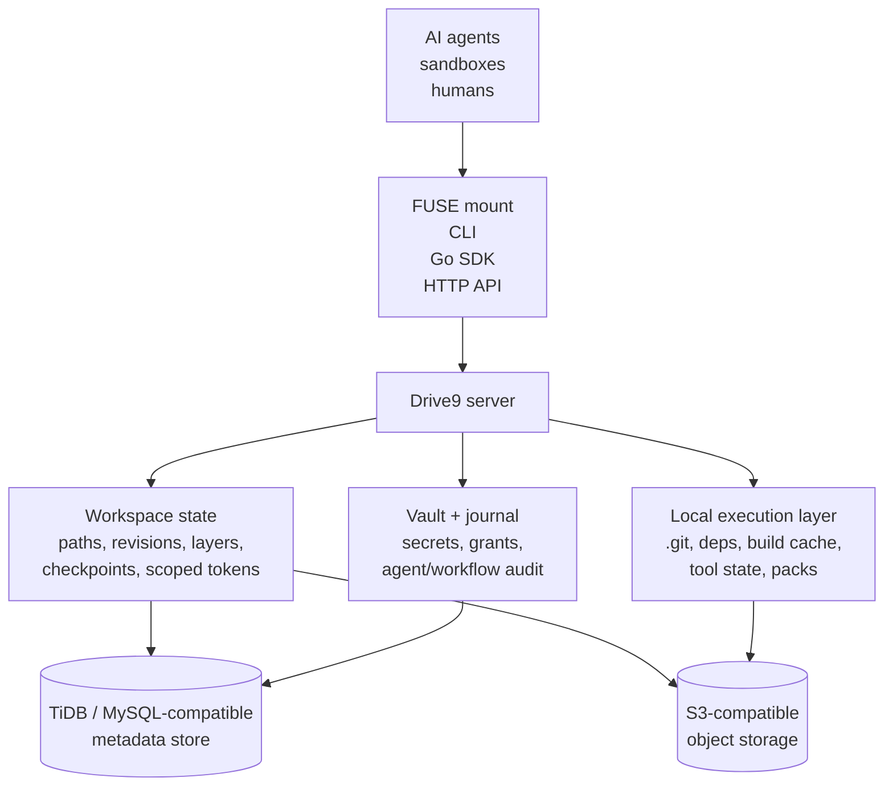

<div align="center">

# Drive9

### Server-side workspace kernel for AI agents

**Sandboxes are disposable. Workspaces should not be.**

[](https://github.com/mem9-ai/drive9/actions/workflows/code-ci.yml)
[](go.mod)
[](#license)
[](docs/)

</div>

Drive9 gives AI agents a durable workspace that can be mounted from any
sandbox, forked for parallel attempts, checkpointed, rolled back, and committed
with server-side conflict detection.

Local disks run the process. Git stores the final result. **Drive9 keeps the
working state in between.**

```bash
# Sandbox A mounts the workspace and starts working.
drive9 mount --mode=fuse --profile=coding-agent :/repo ./work
mkdir -p ./work/notes
printf 'fix attempt A\n' > ./work/notes/run-42.txt
drive9 umount ./work

# Sandbox A is gone. Sandbox B mounts the same workspace and continues.
drive9 mount --mode=fuse --profile=coding-agent :/repo ./work
cat ./work/notes/run-42.txt
```

## Why Drive9

Agents now clone repositories, edit files, install dependencies, run tests,
produce logs, create artifacts, and try multiple approaches. The sandbox may
last minutes; the work often needs to last longer.

Most stacks treat workspace state as an after-the-fact handoff: sync a folder,
commit to Git, dump files into object storage, or serialize session state into a
database. Drive9 moves those runtime questions into the workspace layer:

- Which files, logs, and artifacts survive sandbox replacement?
- Where do parallel attempts stay isolated, commit, or roll back?
- Who decides whether an agent can write this path right now?
- What happens when two attempts started from the same base both want to commit?

Drive9 is runtime-managed workspace state, not just a network folder.

## What It Gives Agents

### Ordinary Filesystem Tools

Mount a server-side workspace and keep using Git, npm, grep, test runners, and
shell scripts. Agents do not need a new file API.

```bash
drive9 ctx add --name prod --server https://api.drive9.ai --api-key "$DRIVE9_API_KEY"
drive9 ctx use prod
drive9 mount --mode=fuse --profile=coding-agent :/ ~/drive9
git clone https://github.com/mem9-ai/drive9.git ~/drive9/drive9
```

### Two-Tier Workspace State

Source files and work products are durable workspace state. `.git`, dependencies,
build outputs, and tool caches can stay in the local execution layer and be
restored with pack/unpack when a replacement sandbox needs a warm workspace.

```bash
drive9 mount --mode=fuse --profile=portable :/workspace /mnt/workspace
# work with normal tools; local overlay paths stay local for tool performance
drive9 pack --mount /mnt/workspace

drive9 unpack --local-root /tmp/new-local --remote-root /workspace --profile portable
drive9 mount --mode=fuse --profile=portable :/workspace /mnt/workspace
```

### Scoped Workspace Access

Issue short-lived filesystem credentials scoped by path, operation, and time.
Agents get the workspace surface they need, not a full workspace key.

```bash
drive9 token issue agent-17 \
  --ttl 1h \
  --allow /repo/src:read,list,search,write \
  --allow /repo/tests:read,list,search
```

Expected behavior under that token:

```bash
cat /repo/src/main.go          # allowed
cat /repo/tests/auth_test.go   # allowed
echo x > /repo/tests/new.log   # denied: write not granted
cat /repo/secrets/token.txt    # denied: path outside scope
```

### Fast Git Workspaces

Clone repositories into a Drive9 mount with Git-aware fast clone support. Use a
blobless local `.git` and hydrate clean tree content as needed.

```bash
drive9 mount --mode=fuse --profile=coding-agent :/ ~/drive9
drive9 git clone --fast --blobless --hydrate=background \
  https://github.com/mem9-ai/drive9.git ~/drive9/drive9
```

### Server-Side Context Forks

Create a copy-on-write workspace context for heavier exploration. A fork can be
mounted from another sandbox without copying the whole workspace up front.

```bash
drive9 ctx fork experiment-auth --from prod
drive9 ctx use experiment-auth
drive9 mount --mode=fuse :/ ./work
```

### LayerFS Attempts

Run writable attempts over a read-only base. Failed attempts roll back without
polluting the base; successful attempts commit back after Drive9 checks whether
the base changed.

```bash
# Two agents start from the same base workspace.
drive9 fs layer create :/repo --name fix-auth-a --tag agent=a
drive9 fs layer create :/repo --name fix-auth-b --tag agent=b

drive9 mount --mode=fuse --profile=coding-agent --layer fix-auth-a :/repo ./attempt-a
drive9 mount --mode=fuse --profile=coding-agent --layer fix-auth-b :/repo ./attempt-b

# Each agent edits, tests, and checkpoints independently.
drive9 fs layer checkpoint fix-auth-a --label tests-pass
drive9 fs layer checkpoint fix-auth-b --label alternative-pass

# The first commit updates the base. The second is preserved if it conflicts.
drive9 fs layer commit fix-auth-a
drive9 fs layer commit fix-auth-b   # becomes conflicted if the base moved
```

A conflicted layer is not silently overwritten or discarded. It stays available
for review, diff, rollback, or manual resolution.

### Vault and Journal Surfaces

Workspace state often depends on credentials and audit trails. Drive9 includes a
vault namespace for scoped secrets and an append-only journal for agent/workflow
events.

```bash
drive9 mount vault /n/vault
drive9 vault grant /n/vault/prod-db/DB_URL --agent alice --perm read --ttl 1h

drive9 journal new -id run-42 -title "run 42"
echo '{"type":"tool.call.completed","summary":{"tool":"pytest"}}' \
  | drive9 journal append run-42
drive9 journal verify run-42
```

## Architecture



Small files and metadata live in the metadata store. Large content, LayerFS
objects, and local-state packs use S3-compatible object storage. Drive9 owns
mount, fork, attempt, checkpoint, rollback, commit, conflict handling, scoped
access, and audit/search metadata.

## Runtime-Managed, Not After-the-Fact

| Approach | Where state mainly lives | Best at | Limit |
| --- | --- | --- | --- |
| Local sandbox disk | One sandbox or VM | Fast execution | Dies with the sandbox |
| Git | Repository history | Final review and merge | Weak for logs, caches, failed attempts, and work-in-progress state |
| Object storage + database | Application code | Custom persistence | Every framework rebuilds branching, recovery, permissions, and conflicts |
| ArtifactFS-style FUSE + Git systems | Local overlay plus Git handoff | Repo cold start and Git-native workflow | Workspace state is mostly handed off after work happens |
| AgentFS-style session systems | Portable session database | Queryable agent/session state | Workspace files are not a live server-side runtime object |
| **Drive9** | Server-side workspace state | Runtime workspace lifecycle | Requires a Drive9 server and explicit workspace model |

Use ArtifactFS-style systems when the main problem is opening repositories
quickly. Use AgentFS-style systems when the main problem is carrying a portable
session database. Use Drive9 when the main problem is managing the worksite while
agents are still working.

## Quick Start

Build the binaries:

```bash
go build -o bin/drive9 ./cmd/drive9
go build -o bin/drive9-server ./cmd/drive9-server
go build -o bin/drive9-server-local ./cmd/drive9-server-local
```

Connect to a Drive9 server and mount a workspace:

```bash
bin/drive9 ctx add --name dev --server https://api.drive9.ai --api-key "$DRIVE9_API_KEY"
bin/drive9 ctx use dev
bin/drive9 mount --mode=fuse --profile=coding-agent :/ ~/drive9
```

Simulate a sandbox handoff:

```bash
# Sandbox A
printf 'notes from run 42\n' > ~/drive9/run-42.txt
bin/drive9 umount ~/drive9

# Sandbox B
bin/drive9 mount --mode=fuse --profile=coding-agent :/ ~/drive9
cat ~/drive9/run-42.txt
```

## Boundaries

- Drive9 keeps workspace state; another system still runs the sandbox process.
- It does not preserve live processes, sockets, terminals, or in-memory model context.
- It is not a Git replacement; Git remains the final review and history layer.
- It targets agent workspace workloads, not full general-purpose POSIX compatibility.
- Search and semantic metadata exist, but Drive9 is not a vector-memory product.

## Documentation

- [LayerFS V1 design](docs/design/layered-filesystem-v1-design.md)
- [Pack/unpack profile spec](docs/design/pack-unpack-profile-spec.md)
- [Git fast clone workspace design](docs/design/git-fast-clone-workspace.md)
- [Vault quickstart](docs/guides/vault-quickstart.md)

## Development

```bash
go test ./...
go test -race ./pkg/fuse ./pkg/backend ./pkg/server
```

Focused end-to-end suites live under `e2e/`, including FUSE write/read gates,
Git workflow gates, portable pack/unpack, and LayerFS smoke tests.

Note: the public project is Drive9; the Go module path is currently `github.com/mem9-ai/dat9`.

## License

Apache 2.0.
