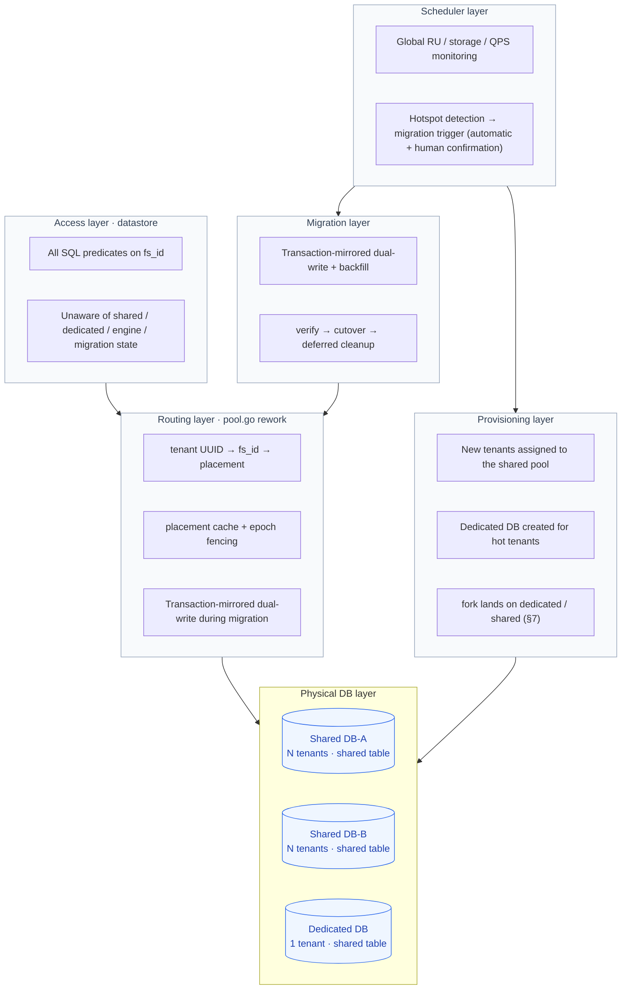
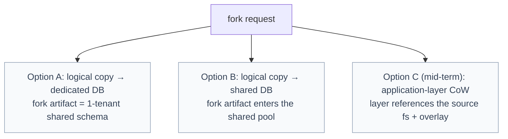
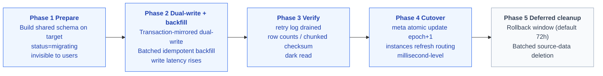
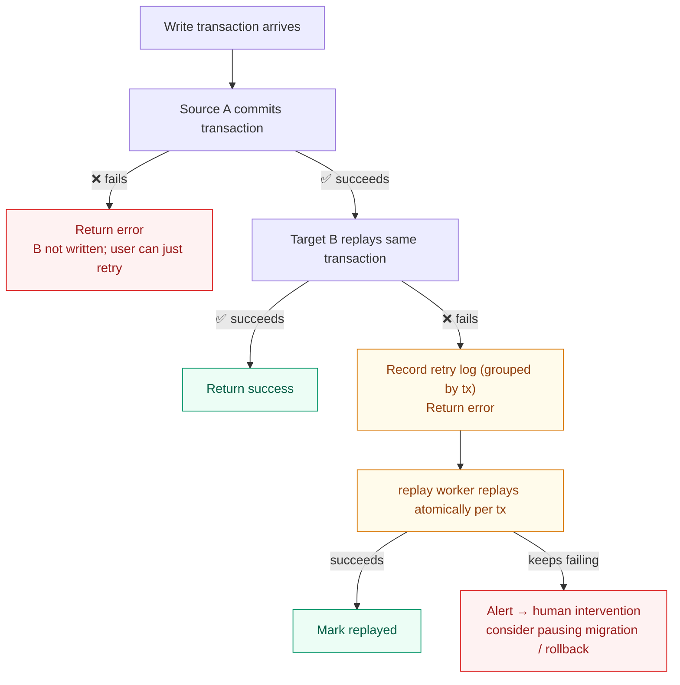
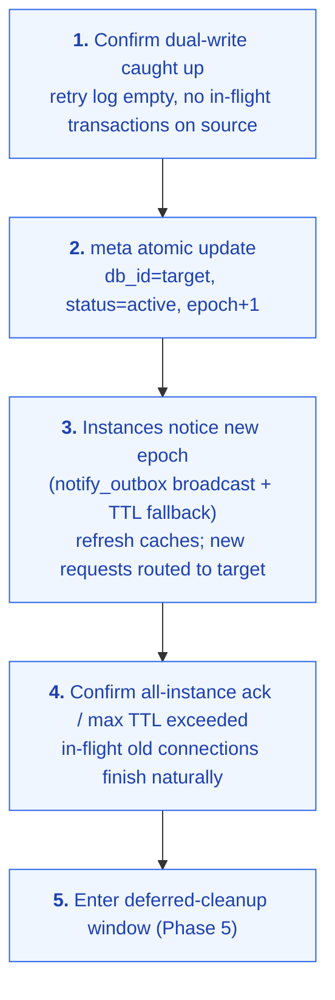
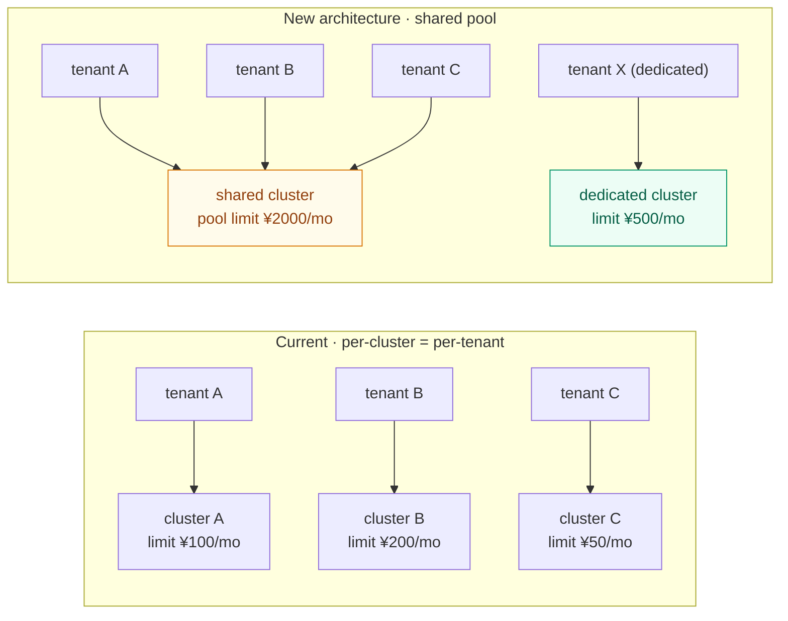
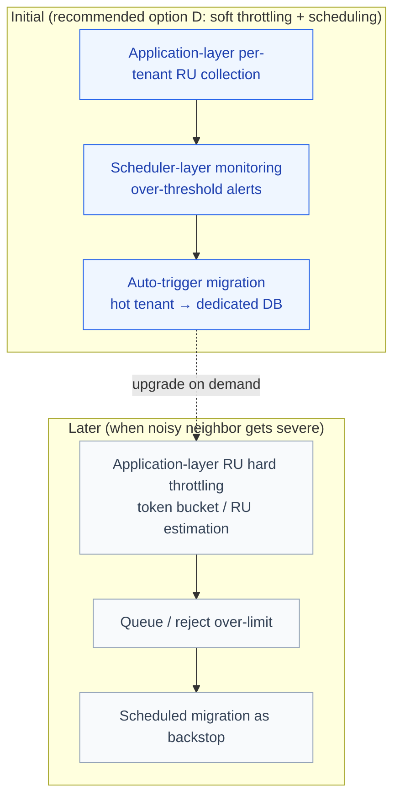
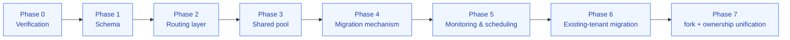
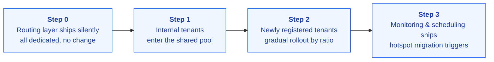

# Drive9 Tenant DB Architecture Redesign

> Core design decisions:
> 1. **Identity model**: keep the existing external `tenant_id` (VARCHAR(64) UUID); add a new internal `fs_id BIGINT` to shared tables as the row sharding key — no external compatibility breakage, while gaining the index performance of a numeric key.
> 2. **Fork**: the current fork is based on TiDB Cloud Branch and is tightly bound to the cluster==tenant model; under shared tables it must be redesigned (see §7).
> 3. **Embedding**: shared tables keep only the app-managed mode; auto mode (`EMBED_TEXT` generated columns) no longer applies (see 5.3).

---

## 1. Background and Current State

### 1.1 Current architecture

Each fs (tenant) maps to a dedicated TiDB Cloud Starter (Serverless) cluster (the current provisioner is `tidb_cloud_native`, which creates Starter clusters).

- Each tenant DB contains **32 tables** (Core FS 10 + Git Workspace 5 + FS Layers 5 + Journal 5 + Vault 7)
  - ⚠️ Existing DBs may have a 33rd: the legacy `files` table (`SplitTablesMigrator` does not DROP it; it carries vector/FTS indexes)
  - ⚠️ The Journal 5 tables and Vault 7 tables **already have a `tenant_id VARCHAR(64)` column** — the only part of the 32 tables with a pre-existing row-level multi-tenant shape
  - ⚠️ The db9 provider (PostgreSQL + pgvector) schema has **24 tables** and is out of scope for this redesign (see 5.2.6)
- The provisioner calls the TiDB Cloud OpenAPI to create a dedicated cluster
- `pool.go` builds a dedicated DSN and connection pool per tenant
- Clusters are created under the user's own TiDB Cloud org (using the user's own API credentials)

### 1.2 Proven engineering foundations

| Foundation | Location | Notes |
|---|---|---|
| Provisioning abstraction | `pkg/tenant/provisioner.go` | Provider interface; already supports `db9` / `tidb_zero` / `tidb_cloud_native` |
| Per-tenant schema version management | `pkg/tenant/schema/` | `schema_version` + `InitSchema` + diff/repair |
| LRU connection pool + idle eviction | `pkg/tenant/pool.go` | max 1024 warm backends, keyed by tenant ID string |
| Dynamic DSN construction + KMS password encrypt/decrypt | `pkg/tenant/pool.go` + `pkg/encrypt/` | Supports Aliyun / Tencent / local AES |
| Quota / spending limit management | `pkg/meta/` + `pkg/backend/quota.go` | All enforced at the application layer via the central meta DB |
| **Online migration framework** | `pkg/migrate/split_tables.go` | `SplitTablesMigrator`: idempotent, resumable, auto-triggered on `Acquire` — the direct precedent for this plan's migration layer |
| **Outbox + replay worker** | `pkg/meta/quota.go` + `pkg/backend/mutation_replay.go` | `quota_mutation_log` + `MutationReplayWorker` (atomic claim, batches of 100, max 5 retries) — a ready-made template for the retry log mechanism |
| **Sharded task framework** | `tenant_notify_outbox` + `pkg/server/tenant_worker.go` | 200ms polling + sharded lease — a reusable base for migration orchestration |
| **Pre-warmed cluster pool** | `tenant_tidbcloud_pools` | Existing per-org idle cluster pool; a reference for shared-pool provisioning |
| **Existing dual-write implementation** | `useLegacyFiles` (`store.go`) | legacy files ↔ split tables dual-write already running in production |

### 1.3 Key facts clarification

| Fact | Current state | Impact on this plan |
|---|---|---|
| Tenant identifier | `tenants.id` is a `VARCHAR(64)` UUID v4 string; no numeric tenant key exists anywhere in the DB | Shared tables cannot use `tenant_id BIGINT` directly; an internal `fs_id` must be introduced (see 4.1) |
| fs and tenant | 1:1, no independent fs id | `fs_id` is a new concept introduced by this redesign |
| Fork | `POST /v1/fork` creates a **TiDB Cloud Branch** of the source tenant's cluster | The branch mechanism breaks under shared tables and must be redesigned (§7) |
| Embedding | The `semantic` table has two modes: auto (`VECTOR GENERATED ALWAYS AS EMBED_TEXT(...)` STORED, with model/dimensions burned into the DDL) and app-managed (plain `VECTOR(n)` column); model/dimensions configured per tenant (`tenant_auto_embedding_profiles`) | A single shared table cannot express per-tenant generated columns; must converge to app-managed (see 5.3) |
| Foreign keys / triggers / stored procedures | Zero across the entire DB; referential integrity lives entirely in the application layer | Dual-write does not need to handle DB-level constraints |
| Multi-table transactions | A file write is a single transaction spanning 5~7 tables (`inodes`+`contents`+`semantic`+`file_nodes`+`file_tags`+`semantic_tasks` enqueue) | Dual-write must be in units of **transactions**, not statements (see 8.2) |
| AUTO_INCREMENT | Only `llm_usage.id` and `fs_events.seq` in tenant DBs; `seq` is consumed by the SSE cursor | Shared tables and migration need special handling (see 5.4) |

---

## 2. The Cost Problem

### 2.1 Quantifying the problem

Every Starter cluster has its own baseline cost (storage fees + a small RU floor):

- Cost grows **linearly** with tenant count and cannot be compressed
- `tenant count × baseline = total cost`; sharing cannot amortize it
- (To be filled in: actual baseline cost figures, current monthly bill, growth trend)

### 2.2 Root cause of unsustainable cost

- **The "one fs, one cluster" model**: every tenant bears a dedicated cluster baseline
- Starter clusters do not support sharing or multi-database consolidated billing
- tenant count growth → linear cluster count growth → linear cost growth

---

## 3. Options Considered

### 3.1 Rejected options

| Option | Why rejected |
|---|---|
| Self-hosted Neon | Complex architecture (page server + safekeeper + compute + control plane), needs S3 alongside, few community production cases, unacceptable operational risk |
| Managed RDS (Aurora / Cloud SQL / Supabase) | MySQL/TiDB → PostgreSQL dialect migration, rewriting 32-table DDL + all datastore SQL; unclear short-term payoff |
| CockroachDB | Dialect migration + no vector/FTS |
| Self-hosted TiDB | Operational burden + some Cloud-only features missing |
| Postgres + pgvector | Same dialect migration as above |

**Conclusion: keep TiDB Cloud Starter as the underlying DB; change the multi-tenant isolation model.**

### 3.2 share-cluster (DB-per-tenant) vs share-table

**share-cluster**: one database per tenant inside a single Starter cluster; table structures unchanged.

- Pros: good isolation, small code changes
- Bottleneck: **TiDB Cloud Starter per-cluster table-count limit** (PingCAP's official feedback: "the limit is roughly a few thousand")

| Assumed limit | Tables per tenant | Max tenants per cluster | Enough to amortize cost? |
|---|---|---|---|
| 7,000 | 35 (32 + 3 reserved) | 200 | ❌ still needs many clusters |
| 20,000 | 35 | 571 | ❌ still too high |
| 50,000 | 35 | 1,428 | ⚠️ marginal |

**share-table (the decision)**: all tenants share one set of tables (32), with an `fs_id` column distinguishing rows:

- Per-cluster table count is **fixed at 32**, independent of tenant count
- One Starter cluster can host hundreds to thousands of tenants
- Cost: add the `fs_id` column, rebuild indexes/constraints, change datastore-layer SQL (one-time change)
- Benefit: cost goes from linear growth to **stepwise growth** (a new cluster is opened only when the current one fills up)

---

## 4. Overall Architecture

### 4.1 Identity model: `tenant_id` ↔ `fs_id`

Shared tables need a stable numeric row key, but the existing tenant identifier is a `VARCHAR(64)` UUID that has already permeated every external interface — API keys, quota tables, journal/vault tables, the S3 namespace. **Do not change the external identifier; add an internal mapping**:

```sql
-- meta DB: registry mapping tenant UUID → internal fs_id (assigned at tenant creation, immutable for life)
CREATE TABLE fs_registry (
    fs_id      BIGINT AUTO_INCREMENT PRIMARY KEY,
    tenant_id  VARCHAR(64) NOT NULL UNIQUE,   -- existing tenants.id (UUID)
    created_at TIMESTAMP DEFAULT CURRENT_TIMESTAMP
);
```

| Layer | Identifier used | Notes |
|---|---|---|
| External interfaces (API, quota, existing journal/vault columns, S3 namespace) | `tenant_id` VARCHAR(64) UUID | **Completely unchanged**; zero compatibility breakage |
| meta DB internals (`fs_registry`, `tenant_placements`, `db_pool`, `migration_retry_log`) | `fs_id` BIGINT | Internal key for routing and migration |
| The 32 shared tables | `fs_id BIGINT NOT NULL` | Row sharding key; prefix of every index |
| datastore at runtime | UUID → fs_id resolved on Acquire, cached in-process | All SQL predicates use fs_id |

Existing data handling: the existing `tenant_id VARCHAR(64)` columns in journal/vault tables are uniformly replaced by `fs_id BIGINT` in the shared schema; backfill converts via `fs_registry`. Application-layer interface signatures are unchanged.

### 4.2 Layered architecture overview



### 4.3 Layer responsibilities

**Access layer (business layer / datastore)**

| Dimension | Description |
|---|---|
| Responsibility | Execute business SQL predicated on fs_id |
| Unaware of | Which physical DB instance is underneath; whether the tenant is shared or dedicated; engine type; whether a migration is in flight |
| Interface | Obtains fs_id from context / backend, returns results |
| Changes | Add fs_id predicates to all queries on the 32 tables, prefix indexes with fs_id, change unique constraints to composite (fs_id, ...) |

**Routing layer (pool.go rework)**

| Dimension | Description |
|---|---|
| Responsibility | tenant UUID → fs_id → physical DB connection |
| Core mechanism | Queries meta DB `tenant_placements` (in-process cache + epoch invalidation, see 6.4) |
| Shared DB | Multiple tenants share one `*sql.DB` |
| Dedicated DB | One connection pool per tenant |
| During migration | Transaction-mirrored dual-write, holding source/target connections simultaneously (see 8.2) |
| Routing hot update | meta bumps the epoch; pools refresh on noticing it, without restarting the service |
| Existing-tenant compatibility | Existing per-tenant DBs are marked `placement=dedicated` and handled by routing normally |

**Scheduler layer**

| Dimension | Description |
|---|---|
| Responsibility | Global monitoring + hotspot detection + migration triggering |
| Monitoring | RU / storage / QPS of all DBs; per-tenant RU / storage / QPS (application-layer metrics) |
| Upgrade trigger | tenant RU > threshold_upgrade, sustained for T minutes → shared → dedicated |
| Downgrade trigger | tenant RU < threshold_downgrade, idle for N consecutive days → dedicated → shared |

**Migration layer**: see §8. **Provisioning layer**: DB instance lifecycle + tenant assignment, all unified under the drive9-internal org (§10), compatible with the existing Provider interface.

---

## 5. Schema Changes

### 5.1 General principles

- Add `fs_id BIGINT NOT NULL` to all 32 tables
- Rebuild primary keys as composite `(fs_id, <original PK>)`, using TiDB's clustered index to physically cluster rows by fs_id
- Prefix all secondary indexes with `fs_id`
- Change all unique constraints to composite `(fs_id, ...)`
- Inject the `fs_id` predicate into all queries

### 5.2 Per-table change list

#### 5.2.1 Core FS (10 tables)

| Table | Current PK / unique constraints (actual) | Shared-table change |
|---|---|---|
| `file_nodes` | `UNIQUE idx_path (path_hash)`; `KEY idx_parent (parent_path_hash, name)` | `UNIQUE(fs_id, path_hash)`; `KEY(fs_id, parent_path_hash, name)` |
| `inodes` | `PK (id)` (ULID string) | Composite primary key `(fs_id, id)` |
| `contents` | `UNIQUE (inode_id)` | `UNIQUE(fs_id, inode_id)` |
| `semantic` | `PK (inode_id)` | Composite primary key `(fs_id, inode_id)`; vector/FTS index changes in 5.3 |
| `file_tags` | `UNIQUE (file_id, key)` | `UNIQUE(fs_id, file_id, key)` |
| `uploads` | `UNIQUE (upload_id)`; generated column `active_target_path_hash VIRTUAL` + unique index | `UNIQUE(fs_id, upload_id)`; `UNIQUE(fs_id, active_target_path_hash)` |
| `semantic_tasks` | `UNIQUE (task_id)`; `UNIQUE (task_type, resource_id, resource_version)` | Add `fs_id` prefix to both unique constraints |
| `file_gc_tasks` | `UNIQUE (task_id)`; `uk_file_gc_file_id`; `uk_file_gc_inode_id` | Add `fs_id` prefix to all three unique constraints |
| `llm_usage` | `id AUTO_INCREMENT PK` | `id` stays a purely physical primary key (cluster-global auto-increment); add `KEY(fs_id, ...)`; see 5.4 |
| `fs_events` | `seq AUTO_INCREMENT PK` | Same as above; add `KEY(fs_id, seq)`; SSE cursor handling in 5.4 |

#### 5.2.2 Git Workspace (5 tables)

`git_workspaces` / `git_workspace_tree_nodes` / `git_workspace_git_state` / `git_workspace_object_packs` / `git_workspace_overlay`: add the `fs_id` column + index prefixes + composite unique constraints (`workspace_id` is a UUID string; same pattern as above).

#### 5.2.3 FS Layers (5 tables)

`fs_layers` / `fs_layer_tags` / `fs_layer_entries` / `fs_layer_events` / `fs_layer_checkpoints`: same as above.

#### 5.2.4 Journal (5 tables) and Vault (7 tables)

`journals` / `journal_labels` / `journal_append_requests` / `journal_entries` / `journal_entry_subjects`;
`vault_deks` / `vault_secrets` / `vault_secret_fields` / `vault_tokens` / `vault_grants` / `vault_policies` / `vault_audit_log`.

These 12 tables **already have a `tenant_id VARCHAR(64)` column and tenant-prefixed keys**. The shared schema replaces that column with `fs_id BIGINT` (narrower indexes, faster joins); existing data is converted via `fs_registry` during backfill. Application-layer method signatures (which take the tenant UUID string) are unchanged.

#### 5.2.5 Handling the legacy `files` table

- The legacy `files` table **does not enter** the shared schema
- Prerequisite for existing-tenant migration: the tenant has completed `SplitTablesMigrator` (data already in the new tables)
- If a tenant has not finished the split: the migration pipeline first triggers/waits for the split to complete, then starts fs-level migration (order: intra-DB table split first, cross-DB migration second)
- Phase 0 must inventory the distribution and data volume of legacy `files` tables across existing DBs

#### 5.2.6 db9 provider (out-of-scope statement)

db9 (PostgreSQL + pgvector, 24 tables) is **not in scope** for this shared-table redesign and keeps its per-tenant instances as-is. All schema / SQL changes in this plan target only the TiDB/MySQL providers. db9's long-term positioning (whether to also adopt sharing, whether to retire it) is a separate decision.

### 5.3 The `semantic` table and embedding-mode convergence

**Problem**: in auto mode, `semantic.embedding` / `description_embedding` are `VECTOR(n) GENERATED ALWAYS AS (EMBED_TEXT(model, content, options)) STORED` generated columns — **model and dimensions are burned into the DDL**, and each tenant has its own embedding profile. A single shared table can have only one generated-column expression, which fundamentally conflicts with per-tenant model/dimensions.

**Decision: shared tables keep only the app-managed mode.**

| Dimension | Decision |
|---|---|
| Shared-table schema | `embedding` / `description_embedding` are plain `VECTOR(n)` columns, **no generated columns**; embeddings are computed by the application layer and written in (app-managed) |
| auto mode | No longer applies to shared tables. When an existing auto-mode tenant migrates, the migration pipeline recomputes embeddings at the application layer and writes them to the target; after migration it runs as app-managed |
| Model / dimensions | Shared tables use one standard model and dimension (Phase 0 completes the selection and the re-embedding cost estimate for existing tenants); mixing vectors from multiple models in one column corrupts distance metrics — **not allowed** |
| Custom models | Kept as a **differentiating capability of dedicated DBs**: tenants needing custom embedding models are scheduled to dedicated DBs (schema likewise has no generated columns, but column dimensions/model can vary as needed) |
| Retrieval compatibility | Query vectors are computed by the application layer with the same standard model; `VEC_EMBED_COSINE_DISTANCE` computation is unchanged |

**To be verified (already in Phase 0)**: the current DDL builds indexes with `VEC_COSINE_DISTANCE` while queries use `VEC_EMBED_COSINE_DISTANCE`; first verify whether the vector index is actually hit under current queries, then design the fs_id-prefixed index shape.

### 5.4 Special handling for AUTO_INCREMENT tables

| Table | Current state | Shared-table handling |
|---|---|---|
| `llm_usage` | `id AUTO_INCREMENT` | Keep the auto-increment id as a cluster-global physical primary key (physical ordering only); all queries go through `(fs_id, ...)` indexes; no external references, so values need not be preserved during migration |
| `fs_events` | `seq AUTO_INCREMENT`, consumed by the SSE cursor (`WHERE seq > cursor`) | In shared tables seq is globally monotonic with per-tenant gaps — `WHERE fs_id=? AND seq>cursor` semantics stay correct; **seq values cannot be preserved during migration**. On cutover, write a migration checkpoint event into the target DB; the SSE layer detects it and tells clients to re-sync their cursor |

### 5.5 Partitioning strategy

Optional: HASH partition by `fs_id` (`PARTITION BY HASH(fs_id) PARTITIONS N`).

| Dimension | Notes |
|---|---|
| Effect | Automatic partition pruning when queries carry fs_id |
| Partition count | Evaluate based on tenant density and per-partition data volume |
| Caveat | Compatibility of vector / FTS indexes on partitioned tables must be verified (Phase 0) |
| Initial strategy | Can skip partitioning (rely on composite PK + index-prefix pruning); introduce it later as data volume grows |

### 5.6 Dual-shape window of old and new schemas

- **Dedicated DBs always use the shared schema** (shared tables with 1 tenant) — ensuring "shared ⇄ dedicated" migration is pure data movement between isomorphic schemas
- **The old schema (no fs_id column) exists only in existing per-tenant DBs awaiting migration**
- During the whole existing-tenant migration window, datastore must support both schema shapes simultaneously, plus shape translation during dual-write (there is precedent and hard-won lessons from the `useLegacyFiles` dual-shape maintenance)
- datastore picks the SQL shape from the placement's schema flag; the goal is to delete the old-shape code paths wholesale once existing-tenant migration completes

### 5.7 Schema version management

| Dimension | Notes |
|---|---|
| Version registration | Reuse the existing `schema_version` + `InitSchema` + diff/repair mechanism; the shared schema registers as a new version |
| Granularity change | schema_version goes from per-tenant-DB to **per-physical-DB** (a shared DB has one version serving all its tenants) |
| New shared / dedicated DBs | Apply the shared schema directly |
| Existing per-tenant DBs | Keep the current schema until migration completes |

### 5.8 Datastore-layer changes

| Dimension | Notes |
|---|---|
| fs_id resolution | On Acquire, tenant UUID → fs_id (`fs_registry`), cached in-process; SQL predicates use fs_id |
| SQL injection | All queries get the fs_id predicate injected |
| Connection acquisition | From per-tenant DSNs to DB connections returned by the routing layer |
| Dual-write support | Writes support transaction-mirrored dual-write during migration (see 8.2) |
| Change surface | 32 tables × all CRUD methods, with a uniform change pattern |

---

## 6. Shared Pool and Routing

### 6.1 Sharing density

By default every N tenants share one Starter instance:

- **N's initial value is based on**: the capacity ceiling of a single Starter cluster (RU/s, storage cap); expected activity rate (most tenants low-activity, a few hot); preliminary estimate **N = 100 ~ 1000**
- **How N is determined**: theoretical estimate `average per-tenant RU consumption × N < cluster RU ceiling × safety factor`; validation through gradual rollout (start at N=100 and raise stepwise); dynamic adjustment from runtime data

### 6.2 Shared-pool assignment strategy

- New tenants are assigned to the **least-loaded** DB in the shared pool at creation time
- When the shared pool is full (tenant count reaches N or RU nears the ceiling), create a new Starter cluster into the pool
- Best-effort avoidance of high-load DBs (reduces noisy neighbor)
- Can reuse the existing `tenant_tidbcloud_pools` pre-warmed pool idea to shorten the wait for a new cluster to join the pool

### 6.3 New meta DB tables

> Naming note: `db_pool` and the existing `tenant_tidbcloud_pools` (pre-warmed idle cluster pool) are different concepts; the former is the shared-pool physical DB registry. Keep them distinct in DDL and docs.

```sql
CREATE TABLE db_pool (
    db_id          BIGINT AUTO_INCREMENT PRIMARY KEY,
    dsn            VARCHAR(500) NOT NULL,   -- KMS-encrypted password stored in a separate column
    tier           VARCHAR(20) NOT NULL,    -- 'cold' | 'warm' | 'hot'
    role           VARCHAR(20) NOT NULL,    -- 'shared' | 'dedicated'
    spending_limit BIGINT,                  -- cluster-level spending limit (see §11)
    tenant_count   INT DEFAULT 0,
    max_tenants    INT NOT NULL,
    created_at     TIMESTAMP DEFAULT CURRENT_TIMESTAMP
);

CREATE TABLE tenant_placements (
    fs_id        BIGINT PRIMARY KEY,        -- internal key, linked to tenant UUID via fs_registry
    db_id        BIGINT NOT NULL,
    placement    VARCHAR(20) NOT NULL,      -- 'shared' | 'dedicated'
    status       VARCHAR(20) NOT NULL,      -- 'active' | 'migrating'
    target_db_id BIGINT,                    -- non-null while migrating
    epoch        BIGINT NOT NULL DEFAULT 1, -- routing fencing: +1 on every routing change
    updated_at   TIMESTAMP DEFAULT CURRENT_TIMESTAMP ON UPDATE CURRENT_TIMESTAMP
);
```

### 6.4 Routing cache and epoch fencing

`tenant_placements` lookups must not enter the per-request hot path (the meta DB would immediately become a bottleneck and a single point of failure). Design:

| Mechanism | Notes |
|---|---|
| In-process cache | pool caches `fs_id → (db_id, epoch, status)`; a hit connects directly |
| Invalidation | Short TTL (seconds) + active invalidation (reuse `tenant_notify_outbox` to broadcast placement changes) |
| epoch fencing | epoch+1 on every routing change; the cutover flow uses epoch to confirm all instances have refreshed (see 8.5) |
| meta DB failure | Cache fallback + fail-open, following the existing quota-cache precedent; migration-type operations (changing placement) must hit meta directly |

---

## 7. Fork Redesign

### 7.1 Current state: fork = TiDB Cloud Branch

Current implementation of `POST /v1/fork`: create a **TiDB Cloud Branch** based on the source tenant's cluster as the new tenant's DB (`pkg/server/fork.go`; `tenants.parent_tenant_id`; `TenantKindFork`).

- Advantage: **zero-copy, minute-level**; the branch is implemented via CoW in the TiDB Cloud storage layer
- Binding: this mechanism fundamentally assumes **cluster == tenant**

### 7.2 Problem: branch breaks under the shared-table model

With shared tables, the rows of N tenants are mixed in one cluster; **there is no way to do a cluster-level branch of a single tenant's data**. fork is a core drive9 feature (parallel attempts, experiment isolation), so a replacement must be provided.

### 7.3 Candidate options



| Dimension | A: copy → dedicated | B: copy → shared | C: application-layer CoW (mid-term) |
|---|---|---|---|
| Mechanism | SELECT all rows of the source fs_id → write into a new dedicated DB | Same source SELECT → write into a shared-pool target DB (new fs_id) | The new fs records only layer references to the source fs; reads pass through, writes go to an overlay |
| fork latency | Proportional to data volume (minutes~hours) | Same as left | **Seconds, zero-copy** |
| Extra cost | One cluster baseline per fork | No extra cluster | None |
| fork-of-fork | Can keep branching between dedicated clusters | Still needs logical copy | Natively supported (layer chain) |
| Implementation | **Fully reuses the migration pipeline** (isomorphic schema, source-side read-only snapshot + target writes + verification) | Same as left | Read path must support cross-fs references + reference counting to prevent source deletion; large change |
| Source fs constraint | None | None | The source fs cannot be deleted/cleaned up while referenced |
| Consistency | Writes continuing on the source during copy must be caught up (reuse dual-write) or a short read-only window | Same as left | Natively consistent (same physical data) |

### 7.4 Decision

| Stage | Decision |
|---|---|
| Short term (lands with this plan) | **A is the default** (fork artifacts land on dedicated DBs, preserving the "a fork can independently go hot at any time" semantics, and fork-of-fork can fall back to branch); small-data tenants may choose B to save cost. Both share the same logical-copy pipeline — a read-only variant of the §8 migration mechanism (catch-up via transaction-mirrored dual-write while the source keeps writing) |
| Mid term | Evaluate **C: application-layer CoW fork based on fs_layers**. drive9 already has a layer/overlay mechanism (the 5 `fs_layers` tables); once fork is promoted to an FS-layer primitive, it can be second-level and zero-copy, no longer depending on any DB feature — also the long-term direction for breaking the TiDB Branch binding |
| Existing tenants | During the window, branch fork between not-yet-migrated dedicated clusters remains usable; logical copy takes over after migration completes |

**Semantic-change disclosure**: logical-copy fork latency changes from "minute-level (data-volume independent)" to "proportional to data volume". The API/docs must disclose fork as an asynchronous operation (state machine: copying → catching-up → ready); the fork experience for large filesystems needs product-side confirmation.

---

## 8. Migration Mechanism: Transaction-Mirrored Dual-Write + Backfill

### 8.1 Five-phase overview



| Phase | Key actions | User perception |
|---|---|---|
| 1 Prepare | Build shared schema on the target DB; meta updates `status=migrating, target_db_id` | None |
| 2 Dual-write + backfill | **Turn on dual-write first, then backfill**; reads always go to the source; write latency rises | Write latency rises |
| 3 Verify | retry log drained → row-count comparison → chunked checksum / dark read | None |
| 4 Cutover | Dual-write caught up → meta atomic update (epoch+1) → instances refresh | Millisecond-level |
| 5 Deferred cleanup | Source data retained during the rollback window; batched DELETE afterwards | None |

> **Why turn on dual-write before backfilling?** Backfill first and dual-write second would lose new writes made during the backfill. With dual-write first, new writes are not lost, and the backfill overwrites idempotently with `ON DUPLICATE KEY UPDATE` (see 8.3).

### 8.2 Transaction boundaries of dual-write

A drive9 write is **a single transaction spanning 5~7 tables** (file write: `inodes`+`contents`+`semantic`+`file_nodes`+`file_tags`+`semantic_tasks` enqueue). Dual-write cannot be in units of individual SQL statements — statement-level dual-write leaves half a transaction behind when the target DB fails. Therefore:

**Dual-write unit = the mirror of an application transaction.**

| Design point | Notes |
|---|---|
| Where implemented | A migration proxy wrapping the datastore Store interface: after side A's transaction commits successfully, replay the whole group of changes in one transaction on side B using **the same method calls and arguments** |
| Why function-level replay | All writes go through datastore methods; function-level replay naturally preserves transaction boundaries and write order, with no need for SQL row-level change capture |
| B succeeds | Return success to the user |
| B fails | Record the whole group of changes (tx_id + method + arguments) into the retry log and return error to the user; replay in the background **per transaction** atomically |
| Ordering guarantee | Writes of the same fs are serialized through the routing layer (or ordered by tx sequence), ensuring B's replay order matches A's |
| Cost | Higher write latency during migration (A commit + B replay serialized) |

### 8.3 Backfill

| Point | Approach | Reason |
|---|---|---|
| Batching | 1000 rows per batch, sleep between batches, configurable rate | Avoid big queries impacting other tenants on the shared DB |
| Idempotency | `ON DUPLICATE KEY UPDATE` (**do not use** `INSERT IGNORE` / `REPLACE INTO`) | INSERT IGNORE skips rows with older versions causing inconsistency; REPLACE INTO's delete-then-insert semantics has side effects |
| Table by table | Backfill only one table at a time | Control pressure on the source DB |
| DELETE synchronization | Backfill SELECT cannot see already-deleted rows; deletions are guaranteed entirely by dual-write + retry log | Separation of concerns |
| AUTO_INCREMENT tables | `llm_usage.id` / `fs_events.seq` values are not preserved; the target side auto-increments anew (see 5.4) | Shared-table auto-increment cannot preserve values |

### 8.4 Dual-write failure handling

#### 8.4.1 Write ordering and failure matrix



Choose **A first, B second**: A is the read source during migration, so A's consistency takes priority; a B failure only means the target temporarily lags, covered by the retry log.

| Scenario | A | B | User perception | Handling |
|---|---|---|---|---|
| Normal | ✅ | ✅ | success | — |
| A fails | ❌ | not written | error | User retries |
| B fails | ✅ | ❌ | error | Record retry log for background replay; on user retry A is idempotent (ODKU / business idempotency keys) |
| A fails, B succeeds | ❌ | ✅ | error | Should not happen (A first, B second); if a bug causes it, verification finds B row count > A — roll back and re-sync |
| Both fail | ❌ | ❌ | error | User retries |

**User-retry semantics when A succeeds and B fails**: the user gets an error but A has already taken effect. Writes on side A must be idempotent (INSERT uses ODKU; business operations like `cp /a /b` treat a unique-constraint conflict as already-exists), so user retries do not error; B is caught up by the retry log.

#### 8.4.2 retry log (reusing the quota outbox pattern)

`migration_retry_log` is semantically isomorphic to the production `quota_mutation_log` + `MutationReplayWorker` (atomic claim, batched replay, max retries, alerting), and directly reuses that implementation pattern:

```sql
CREATE TABLE migration_retry_log (
    id          BIGINT AUTO_INCREMENT PRIMARY KEY,
    fs_id       BIGINT NOT NULL,
    db_id       BIGINT NOT NULL,        -- target DB
    tx_id       VARCHAR(64) NOT NULL,   -- one group per application transaction
    tx_seq      INT NOT NULL,           -- order within the transaction
    table_name  VARCHAR(100) NOT NULL,
    row_key     VARCHAR(200) NOT NULL,
    op_type     VARCHAR(20) NOT NULL,   -- 'insert' | 'update' | 'delete'
    payload     JSON NOT NULL,          -- method + arguments (needed for function-level replay)
    created_at  TIMESTAMP DEFAULT CURRENT_TIMESTAMP,
    retry_count INT DEFAULT 0,
    status      VARCHAR(20) DEFAULT 'pending', -- 'pending' | 'replayed' | 'failed'
    KEY idx_claim (status, id)
);
```

Replay rules: entries with the same `tx_id` are replayed in `tx_seq` order within **a single transaction**; replay is idempotent (ODKU); `retry_count >= max` sets `failed` and alerts for human intervention.

#### 8.4.3 retry log and cutover

| Checkpoint | Condition | If not met |
|---|---|---|
| Enter verification (Phase 3) | retry log has no pending entries | Wait for catch-up; pause migration on timeout |
| Execute cutover (Phase 4) | retry log still empty | Cutover not allowed |
| Sustained backlog | Growth exceeds threshold | Pause migration, human intervention; consider rollback |

### 8.5 Cutover and fencing

Routing cutover needs an explicit awareness mechanism and multi-instance safety guarantees, otherwise "the pool layer refreshes once it notices" is just a slogan. This plan adopts **epoch fencing**:



| Guarantee | Mechanism |
|---|---|
| No data loss | Return only after dual-write sync succeeds; cut over only when the retry log is drained |
| Cutover atomicity | One-row meta update (db_id + epoch); pools refresh by epoch |
| Multi-instance safety | Un-refreshed instances keep reading/writing the source (dual-write still on, no data loss); **cleanup must wait for all-instance ack or max TTL** |
| Cleanup safety | Before Phase 5 deletes source data, confirm all active instances have epoch ≥ cutover epoch |

### 8.6 Rollback and deferred cleanup

| Window | Rollback capability |
|---|---|
| Before cutover (Phase 1~3) | Roll back anytime: stop dual-write, delete target data, keep the source |
| After cutover, before cleanup (rollback window, default 72h) | Source data fully retained; rollback = meta switched back to source + new writes during the window reverse-synced (reuse the dual-write mechanism in reverse) |
| After cleanup | No rollback |

Deferred cleanup also covers the escape need of "the target DB turns out to be broken right after cutover". Window length is configured per fs data volume and business tolerance.

### 8.7 Consistency verification

| Method | Notes |
|---|---|
| Row-count comparison | Per-table `COUNT(*) WHERE fs_id=?` compared on both sides |
| Chunked checksum | Chunk by primary-key range, aggregate-compare `BIT_XOR(CRC32(CONCAT_WS(...)))`; **do not use** `CRC32(GROUP_CONCAT(id))` (limited by `group_concat_max_len`, overflows on large tables) |
| Dark read | Run the same query against source/target and compare (sampling) |

### 8.8 Reusing existing mechanisms

| Existing mechanism | Location | Role in this plan |
|---|---|---|
| `SplitTablesMigrator` | `pkg/migrate/` | Execution template for online, idempotent, resumable migration; precedent for triggering existing-tenant migration on `Acquire` |
| `quota_mutation_log` + `MutationReplayWorker` | `pkg/meta/quota.go`, `pkg/backend/mutation_replay.go` | Direct implementation template for `migration_retry_log` + replay worker |
| `tenant_notify_outbox` + sharded lease | `pkg/server/tenant_worker.go` | Base for the migration orchestrator (state machine) and epoch broadcast |
| `semantic_tasks` / `file_gc_tasks` lease tasks | `pkg/datastore/` | Reference for claim/lease/receipt semantics of migration tasks |
| `tenant_tidbcloud_pools` | `pkg/meta/meta.go` | Pre-warming reference for shared-pool provisioning |

### 8.9 Generality and scenarios

| Scenario | Source | Target | Trigger |
|---|---|---|---|
| Hot upgrade | Shared DB | Dedicated DB | tenant RU exceeds threshold |
| Cold downgrade | Dedicated DB | Shared DB | Low activity for N consecutive days |
| Rebalance | Shared DB-A | Shared DB-B | DB-A overloaded |
| Existing-tenant migration | User-org per-tenant DB | drive9-internal-org shared DB | Phase 6 batch |
| **fork copy** | Any DB | Dedicated / shared DB | fork request (§7, read-only variant of the isomorphic pipeline) |

Source and target DBs can be under different TiDB Cloud orgs. dual-write + backfill is an application-layer approach: **the application layer connects to both DBs separately; no direct DB-to-DB connection is needed** — cross-org connectivity only requires the application → each of the two DBs to be reachable (the application already connects to them separately); Phase 0 connectivity verification is based on this.

### 8.10 Industry benchmarks

| Company | Migration scenario | Correspondence to this plan |
|---|---|---|
| **Stripe** | Splitting hundreds of millions of Subscription rows | Dual-write + Hadoop batch backfill; Scientist dark read; phased cutover (stripe.com/blog/online-migrations) |
| **Stripe** | Petabyte-scale DocDB cross-shard (5M QPS) | Bulk import + bidirectional async replication (full rollback); consistency check before cutover (stripe.dev/blog/how-stripes-document-databases-supported-99.999-uptime) |
| **Notion** | Monolithic Postgres → 480 logical shards | Audit log + catch-up incremental sync; backfill ~3 days; version-number comparison to skip stale updates; dark read (notion.com/blog/sharding-postgres-at-notion) |
| **Slack** | legacy MySQL → Vitess re-sharding | Generic backfill system cloning existing tables during dual-write; double-read diff verification (slack.engineering/scaling-datastores-at-slack-with-vitess) |
| **Gusto** | Overloaded-table split | Single-transaction dual-write; backfill runs only after dual-write is enabled; differ job continuously verifies and alerts (engineering.gusto.com/zero-downtime-table-migrations) |
| **AWS** | High-traffic NoSQL → DynamoDB | Dual-Write Single-Read → Dual-Write Dual-Read comparison → Single-Write Single-Read irreversible cutover (aws.amazon.com/blogs/architecture/middleware-assisted-zero-downtime-live-database-migration) |
| **Mercari** | Spanner balance service v1→v2 | Chose single-transaction dual-write over CDC; batched idempotent backfill; lock-free consistency check (engineering.mercari.com/en/blog/entry/20241113-designing-a-zero-downtime-migration-solution-part-iv) |

| Stage | Industry commonality | This plan |
|---|---|---|
| Dual-write | Synchronous write to both sides (Stripe / Gusto / AWS / Mercari) | ✅ Transaction-mirrored dual-write (8.2) |
| Backfill | Batch backfill after dual-write is enabled | ✅ 8.3 |
| Idempotency | Version comparison / ODKU skip | ✅ ODKU (8.3) |
| Verification | dark read / differ | ✅ 8.7 |
| Cutover | Phased cutover / atomic routing | ✅ epoch fencing (8.5) |
| Rollback | Reverse sync / bidirectional replication | ✅ Rollback possible within the deferred-cleanup window (8.6) |

> **Contrast with Figma**: Figma explicitly avoided dual-write + backfill in its sharding migration, using logical replication + physical failover instead (figma.com/blog/how-figmas-databases-team-lived-to-tell-the-scale). dual-write + backfill is not the only choice, but given drive9's scale and existing outbox infrastructure, application-layer dual-write is the path with the best cost-benefit ratio.

---

## 9. Existing-Tenant Migration

### 9.1 Existing per-tenant DBs → shared DBs

The same transaction-mirrored dual-write + backfill, with two extra handling points:

| Difference | Handling |
|---|---|
| Source is the old schema (no fs_id column) | The dual-write proxy does shape translation: read the source per the old schema, write the target per the shared schema (injecting fs_id); see 5.6 |
| Source may have a legacy `files` table with unfinished split | Prerequisite: run `SplitTablesMigrator` to completion first, then start fs-level migration (see 5.2.5) |

### 9.2 Migration pacing

| Stage | Notes |
|---|---|
| Batching | Batch by user/customer; avoid the risk of a one-shot full migration |
| Priority | Low-activity tenants first (small backfill, short dual-write window); high-activity tenants last or evaluated separately |
| Verification | After each batch completes, verify the cost-reduction effect |

### 9.3 Onboarding existing per-tenant DBs

| Step | Notes |
|---|---|
| Registration | `fs_registry` assigns an fs_id; `tenant_placements` marks `placement=dedicated, status=active` |
| Routing | The routing layer handles them normally (DSN points at the existing cluster); the business layer is unaware |
| Afterwards | Migrate transparently to shared DBs through the migration pipeline per the 9.2 pacing |

---

## 10. DB Instance Ownership Change

### 10.1 Current state

Existing per-tenant DBs are created under the user's TiDB Cloud org (the user's own API credentials). Users must manage their own TiDB Cloud account, billing, and cluster lifecycle.

### 10.2 New architecture

| Dimension | Notes |
|---|---|
| Unified ownership | All DB instances are created and managed under the drive9-internal TiDB Cloud org |
| Unified management | Cluster create/delete/scale, billing, monitoring and alerting, schema version management |
| Transparent to users | Users perceive only fs functionality, not the underlying DB management |

---

## 11. Quota-Related Changes

### 11.1 Current state

The quota system is enforced entirely **at the application layer via the central meta DB**, independent of the underlying physical DB:

| Quota table (meta DB) | Purpose |
|---|---|
| `tenant_quota_config` | Storage / file count / file size / LLM monthly cost caps, `tidbcloud_spending_limit` |
| `tenant_quota_usage` | Real-time storage bytes and file count usage |
| `tenant_file_meta` | Per-file size records |
| `tenant_upload_reservations` | Upload reservations (`AtomicReserveAndInsertUpload` atomic reservation + rollback on over-limit) |
| `tenant_llm_usage` / `tenant_monthly_llm_cost` | LLM billing |
| `quota_mutation_log` | Async quota-change outbox + `MutationReplayWorker` replay |

| Dimension | Field | Enforced at |
|---|---|---|
| Storage cap | `max_storage_bytes` (default 50 GiB) | Application layer `ensureStorageQuota` |
| File-count cap | `max_file_count` (0 = unlimited) | Application layer `ensureFileCountQuotaServer` |
| Per-file size cap | `max_file_size_bytes` (default **0 = unlimited**) | Application layer `ensureFileSizeQuota` |
| Media LLM file count | `max_media_llm_files` (default 500) | Application layer `mediaLLMQuotaExceeded` |
| LLM monthly cost | `max_monthly_cost_mc` (0 = disabled) | Application layer `monthlyLLMCostExceeded` |
| TiDB Cloud spending limit | `tidbcloud_spending_limit` | TiDB Cloud API (per-cluster) |

All quota checks are keyed by tenant UUID in the central meta DB, **regardless of which physical DB the tenant's data lives on**.

### 11.2 What does not change

`tenant_quota_config` / `tenant_quota_usage` / `tenant_file_meta` / `tenant_upload_reservations` / `tenant_llm_usage` / `tenant_monthly_llm_cost` / `quota_mutation_log`, plus the check logic for storage / file count / file size / Media LLM / LLM monthly cost — all keyed by tenant_id and independent of the physical DB — **keep working as-is** after the shared-table migration.

### 11.3 What must change: TiDB Cloud spending limit semantics



| Dimension | Current | New architecture |
|---|---|---|
| Granularity | per-tenant (one cluster per tenant) | per-cluster (N tenants share the limit) |
| Who sets it | User `SET /quota` | drive9 manages centrally (recorded in `db_pool.spending_limit`) |
| Independent per-tenant limit | ✅ | ❌ not for shared tenants; dedicated tenants regain per-tenant semantics |
| `tidbcloud_spending_limit` field | User read/write | Shared tenants: read-only/deprecated; dedicated tenants: drive9 sets it per paid tier |

Code changes: `applyQuotaSet` removes the `MarkQuotaUpdateStarted` / `UpdateQuota` TiDB Cloud API calls for shared tenants, keeping only `SetQuotaConfigPatch` (storage/file/LLM dimensions); `handleQuotaGet` returns the total limit of the hosting cluster, or nothing, for shared tenants.

### 11.4 What must be added: per-tenant RU control

Under the shared model one tenant can eat an entire cluster's RU (noisy neighbor). There is currently no per-tenant QPS/RU throttling (under the per-cluster model it was naturally constrained by the spending limit).



| Candidate | Mechanism | Assessment |
|---|---|---|
| A Application-layer RU-estimation throttling | Estimate each SQL per TiDB RU rules; reject when the per-tenant total exceeds the limit | Engine-agnostic but imprecise estimation |
| B TiDB Resource Control | Resource group caps RU/s per tenant | Precise at engine level; must confirm Serverless support; engine-bound |
| C Pure scheduling backstop | Detect + migrate only | Reactive, cannot prevent in advance |
| **D Soft throttling + scheduling (recommended)** | Application-layer collection + alerting + scheduled migration; add hard throttling later on demand | Moves forward together with Phase 5 monitoring/scheduling |

### 11.5 Quota during migration

| Question | Handling |
|---|---|
| Does backfill write count toward quota? | No. Quota checks sit at the user write entry; backfill goes through a separate channel |
| Where do quota checks happen during dual-write? | Once at the application-layer entry; `tenant_quota_usage` is in the meta DB and does not change with the physical DB |
| Recompute quota usage after migration? | Not needed |
| Spending limit during migration | Shared tenants unaffected; for a dedicated tenant's migration, provisioning sets the new cluster's limit |

### 11.6 User API changes

| API | Change |
|---|---|
| `GET /quota` | storage / file_count unchanged; spending_limit for shared tenants returns the cluster's total limit or nothing |
| `SET /quota` | storage / file_count unchanged; spending_limit cannot be set by shared tenants; optionally add `max_ru_per_minute` |
| Dedicated tenants | spending_limit regains per-tenant settability |

---

## 12. Backup and Recovery

With shared tables, **TiDB Cloud PITR/backup is cluster-granular** — if a single tenant's data is corrupted or accidentally deleted, cluster-level recovery affects all tenants on that cluster.

| Level | Mechanism | Purpose |
|---|---|---|
| Cluster level | TiDB Cloud PITR / snapshots | Only for **disaster recovery** (whole-cluster failure) |
| Tenant level | **Per-tenant logical export**: batch-export the 32 tables by fs_id → S3 (manifest + data files, versioned) | Recovery from single-tenant accidental deletion/corruption; also the basis for cross-region DR and compliance export |
| Restore | Import with a new fs_id (or overwrite-import the original fs_id), remapped via `fs_registry` | The restored artifact is an independent fs; cut over after verification |

Export frequency is configured per paid tier (RPO disclosure); export jobs reuse the backfill pipeline's batched-read capability.

---

## 13. Risks and Mitigations

| # | Risk | Mitigation |
|---|---|---|
| 13.1 | Shared-table noisy neighbor | N starts at 100 and rises through gradual rollout; per-tenant RU monitoring + over-threshold migration to dedicated; long-term RU throttling (11.4) |
| 13.2 | Dual-write failure | retry log replays per tx; cut over only when drained; sustained failure pauses migration for human intervention (8.4) |
| 13.3 | Backfill hurting source DB performance | Batching + sleep + rate limiting; run at off-peak; pause backfill if other tenants' latency exceeds threshold |
| 13.4 | In-flight requests at the cutover instant | Dual-write keeps both sides consistent; old connections finish naturally; epoch fencing guards un-refreshed instances (8.5) |
| 13.5 | Large-tenant DELETE across 32 tables | Batched `LIMIT 10000` + pauses; async in background; executed within the deferred-cleanup window |
| 13.6 | Fuzzy Starter table-count limit | share-table keeps a fixed 32 tables per cluster and does not depend on that limit; Phase 0 confirmation is only a reference for share-cluster |
| 13.7 | Cross-org connectivity | Application-layer dual-write needs no direct DB-to-DB connection, only application → each DB reachable; Phase 0 verification (8.9) |
| 13.8 | Schema version drift | Dedicated DBs also use the shared schema; the old schema exists only in existing DBs awaiting migration; datastore dual-shape during the window (5.6) |
| 13.9 | Shared-DB single point of failure | Serverless multi-AZ; the N cap bounds the blast radius; batch migration on failure; cluster PITR + per-tenant export (§12) |
| 13.10 | **fork latency regression** (branch → logical copy) | fork becomes an async state machine with disclosure; small filesystems barely affected; mid-term application-layer CoW fork fixes it for good (§7) |
| 13.11 | **Vector/FTS + fs_id filtering execution plan** below expectations (post-filter recall dilution) | Phase 0 empirical verification; fallbacks: top-k over-fetch + rerank, HASH partition pruning, two-phase query (5.3, 14.1) |
| 13.12 | **meta DB becoming a hot-path bottleneck and single point of failure** | In-process placement cache + epoch invalidation; quota already has a fail-open precedent; only migration operations hit meta directly (6.4) |
| 13.13 | **AUTO_INCREMENT semantic change** (SSE cursor, llm_usage id) | fs_events writes a migration checkpoint event; SSE triggers client re-sync (5.4) |
| 13.14 | **Shared connection-pool capacity** (aggregated QPS of N tenants on one `*sql.DB`) | Configure `MaxOpenConns` per cluster capacity; monitor connection-wait queues; migrate hot tenants out promptly |

---

## 14. Implementation Plan

### 14.1 Phase overview

| Phase | Tasks |
|---|---|
| **Phase 0 Verification** | ① Table-count limit confirmation ② Single-cluster RU stress test (N tenants sharing) ③ Cross-org connectivity (application → two DBs) ④ scale-to-zero cold start ⑤ **Vector top-k + fs_id filtering execution plan and recall rate** ⑥ **FTS + fs_id filtering execution plan** ⑦ **Verify index hit for `VEC_COSINE_DISTANCE` vs `VEC_EMBED_COSINE_DISTANCE`** ⑧ **Inventory of legacy `files` table distribution** ⑨ **Unified embedding model selection + re-embedding cost estimate for existing tenants** |
| **Phase 1 Schema** | 32-table shared schema (fs_id + indexes + constraints); `semantic` app-managed conversion; `fs_registry`; schema version registration; datastore dual-shape rework |
| **Phase 2 Routing layer** | pool.go routing rework (UUID→fs_id→placement); `tenant_placements` + `db_pool`; cache + epoch fencing; routing hot update |
| **Phase 3 Shared pool** | Shared-pool instance management; new-tenant assignment; provisioning integration (including dedicated-as-shared-schema) |
| **Phase 4 Migration mechanism** | Transaction-mirrored dual-write + backfill; retry log (reusing the MutationReplayWorker pattern); verification + epoch cutover + deferred cleanup; migration orchestration state machine (reusing the notify_outbox base) |
| **Phase 5 Monitoring & scheduling** | Global + per-tenant metrics; hotspot detection + migration triggering |
| **Phase 6 Existing-tenant migration** | Batched migration (each tenant's split migration completes first); verify cost per batch |
| **Phase 7 fork rework + ownership unification** | fork logical-copy pipeline (reusing Phase 4) + async state machine; user-org DB cleanup |



---

## 15. Rollout Plan

### 15.1 General principle: existing tenants untouched, new tenants first

| Principle | Notes |
|---|---|
| **No existing-tenant migration** | Existing per-tenant DBs keep the current schema (no fs_id column); no DDL changes or data migration |
| **Full compatibility** | All existing-tenant functionality (fork, quota, spending limit setting, existing SQL behavior) is exactly the same as today |
| **New tenants first** | The shared pool takes only new tenants; not a single existing tenant enters |
| **Shapes coexist rather than being retired** | Dedicated deployment (one fs, one cluster) **remains a long-term product shape** — e.g. enterprise-tier customers explicitly requesting a dedicated org + a dedicated DB per fs as a paid-isolation scenario; the existing schema is a formally supported long-term shape, not legacy |
| **Every step reversible** | Stepwise rollout; every step has explicit entry conditions and a rollback action |

### 15.2 Shape vocabulary and tenant tiers

Separating two often-conflated dimensions is the key to eliminating the "legacy narrative":

| Dimension | Values | Notes |
|---|---|---|
| Placement | `shared-pool` / `dedicated` | A business and isolation decision: the shared pool amortizes cost; dedicated clusters provide strong isolation and custom ownership |
| Schema shape | `standalone` / `shared` | A purely technical decision: whether tables have the fs_id column |

| Tenant type | Placement | Schema shape | DB ownership | Notes |
|---|---|---|---|---|
| Existing tenants | dedicated | standalone | user's org | Status quo frozen, long-term full compatibility |
| Standard new tenants | shared-pool | shared | drive9 org | Default shape |
| Enterprise dedicated deployment | dedicated | shared | drive9 org or user's org | Paid-isolation shape, retained long-term; enjoys the full capabilities of its own cluster (spending limit settable, etc.) |

Two things behave identically under all shapes and **do not constitute shape differences**:

- **embedding**: unified application-layer writes (5.3); the write path is the same for standalone and shared
- **fork**: unified in-house logical copy (§7), independent of Cloud Branch and of placement

### 15.3 Abstraction-layer design: one set of SQL, shape injected

Goal: **no parallel pair of datastore methods may appear**. Shape differences converge to a single injection point:

```go
// pkg/datastore/scope.go (the only shape branch point)
type Scope struct {
    fsID   int64 // assigned by fs_registry; every tenant (including existing ones) has one
    shared bool  // false = standalone shape (tables have no fs_id column)
}

func (s Scope) And(pred string) string   // shared: "fs_id = ? AND " + pred; standalone: pred
func (s Scope) Args(a ...any) []any      // shared: prepend fsID; standalone: unchanged
func (s Scope) InsCols(c string) string  // shared: "fs_id, " + c; standalone: c
func (s Scope) InsVals(v string) string  // shared: "?, " + v; standalone: v
```

| Layer | Redundancy | Notes |
|---|---|---|
| SQL code paths | **One set** | Each datastore method is written once; SQL is assembled via Scope; in standalone the fs_id predicates and columns disappear automatically. Standalone "compatibility" = the behavior of the same code under `Scope{shared:false}`, not separately maintained legacy code |
| journal / vault | **One set** | These two table groups already take a tenant predicate parameter; Scope only switches the column name and value (standalone uses the `tenant_id` string, shared uses `fs_id`) |
| DDL | Generated | Schema is generated from a per-DB descriptor `{shape}`, reusing the existing schema_version + InitSchema + diff/repair mechanism; no two handwritten copies |
| Routing | One set | placement decides DSN and connection-pool ownership; schema shape is read from placement (`tenant_placements` needs a new `schema` flag column: `'standalone' \| 'shared'`) |
| Explicitly excluded | — | legacy `files` table dual-write (useLegacyFiles) is an earlier-generation intra-table shape problem, isolated in `pkg/migrate`, and does not enter the Scope abstraction; AUTO_INCREMENT semantic differences (5.4) are documented only and produce no code branches |

Test matrix: full regression under both schema shapes `{standalone, shared}` (CRUD / search / vector / FTS / fork / quota); CI must pass both.

### 15.4 Existing-shape (standalone) compatibility guarantees

| Dimension | Design |
|---|---|
| placement registration | All existing tenants registered in `tenant_placements`: `placement=dedicated`, `schema=standalone`, `status=active` |
| Routing | Connect directly to the original cluster DSN; behavior matches the existing `pool.go` point for point |
| datastore | `Scope{shared:false}`: SQL emits no fs_id predicates or columns, verbatim identical to before rollout |
| journal / vault | Keep using the existing `tenant_id VARCHAR(64)` column; no changes at all |
| quota / spending limit | Remains per-cluster user-settable; the 11.3 semantic change **applies only to shared-pool** |
| embedding writes | Switch to application-layer writes together with everyone (5.3); only the write path changes, existing DBs' DDL untouched |
| fs_id pre-assignment | At rollout, batch-pre-assign fs_ids for existing tenants in `fs_registry` (pure meta data, no business data touched), for unified monitoring, Scope simplification, and future optional migration |

### 15.5 Rollout steps



| Step | Actions | Entry conditions | Rollback action |
|---|---|---|---|
| **Step 0: routing layer ships silently** | Deploy new code (routing layer + Scope-ified datastore); register placement for all existing tenants; production behavior has zero diff vs before rollout | Dual-shape full regression passes (standalone-shape CRUD / search / vector / FTS / fork / quota) | Roll back the deployment; the new meta tables have no side effects |
| **Step 1: internal tenants enter the shared pool** | Create the first shared-pool cluster; provision internal / test tenants in the shared shape | Step 0 stable in production; shared-shape functional regression passes | Delete test tenants; scale down or delete the shared cluster |
| **Step 2: gradual rollout for newly registered tenants** | A provisioning switch assigns new tenants to the shared pool by ratio (e.g. 10% → 50% → 100%); **new tenants outside the ratio go to dedicated DBs (shared schema)** — no new standalone-shape DBs are created | Step 1's RU / latency baseline within budget; vector + fs_id query quality spot-checks pass | Turn the ratio back to 0%; all new tenants go dedicated (shared schema); tenants already in the shared pool keep being served |
| **Step 3: monitoring & scheduling ships** | per-tenant RU / QPS / storage collection (**including existing tenants**); hotspot detection; shared → dedicated migration trigger (human-confirmed first, automated after validation) | Stable after Step 2 reaches 100% | Turn off migration triggers, keep monitoring |

### 15.6 Rollback plan summary

| Anomaly | Rollback action |
|---|---|
| Routing-layer bug | Roll back the deployment; the standalone path is exactly as before rollout, inherently zero-risk |
| Shared-cluster failure | Affected tenants migrate to dedicated DBs via the migration pipeline (isomorphic schema, low risk); new-tenant assignment switches back to dedicated |
| Shared-shape functional defect | Affected tenants migrate to dedicated; the shared pool stops taking new tenants |
| Cost below expectations | Freeze the shared-pool / dedicated ratio, keep running as-is, re-evaluate the sharing density N |

### 15.7 Shape maintenance and new-feature rules

| Dimension | Notes |
|---|---|
| New features | Default to one implementation + Scope adapting to both shapes; standalone gets no separate features and no deliberate omissions |
| standalone retirement | **No preset retirement date**; the standalone branch is deleted only when all existing tenants have migrated out or an EOL is officially announced; the decision is driven by cost data and shared stability |
| Long-term value of the dedicated shape | Enterprise paid isolation + upgrade target for hot tenants + default fork destination; coexists with the shared pool long-term |

### 15.8 Relationship to existing-tenant migration (§9) and the implementation plan (§14)

| Item | Positioning change |
|---|---|
| §9 existing-tenant migration, §14 Phase 6 / Phase 7 | Demoted to **optional follow-up phases**: the rollout plan does not include existing-tenant migration; entry conditions = shared pool running stably + sufficient cost-comparison data + the migration pipeline already production-proven in the fork-copy scenario |
| §14 Phase 0 ~ Phase 5 | Required for rollout; order unchanged |
| Migration mechanism (§8) | Right after rollout it has two production uses as backstop validation: hot-tenant shared → dedicated scheduling, and fork logical copy; get these two scenarios running smoothly first, then discuss whether to use it for existing-tenant migration |

### 15.9 Post-rollout cost shape

| Part | Cost curve |
|---|---|
| Existing tenants | Frozen at current levels (cluster count neither grows nor shrinks) |
| New tenants | Enter the shared pool; stepwise growth (a new cluster only when one fills up) |
| Total cost | From "linear growth" to "existing frozen + incremental steps"; break-even depends on new-tenant growth rate |

### 15.10 User-visible differences across tenant shapes (to be disclosed in API / docs)

| Dimension | Existing (dedicated + standalone) | Standard (shared-pool) | Enterprise (dedicated + shared) |
|---|---|---|---|
| spending limit | User-settable (per-cluster) | Not settable (shared-cluster unified limit) | User-settable (per-cluster) |
| embedding | Unified application-layer writes; behavior identical | Same as left | Same as left |
| fork | Logical copy (in-house, async) | Same as left | Same as left |
| Underlying ownership | Independent cluster in the user's org | Shared cluster in the drive9 org | Independent cluster in the user's org or drive9 org |
