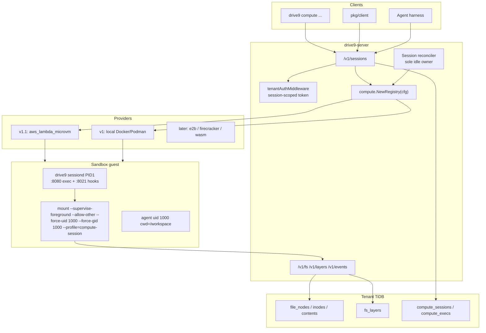
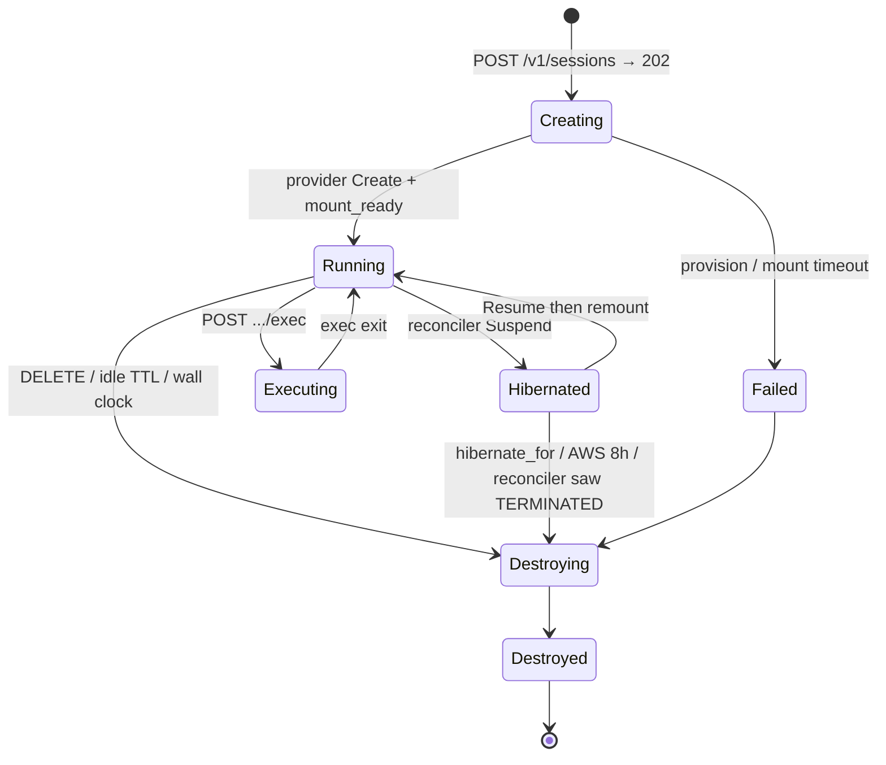
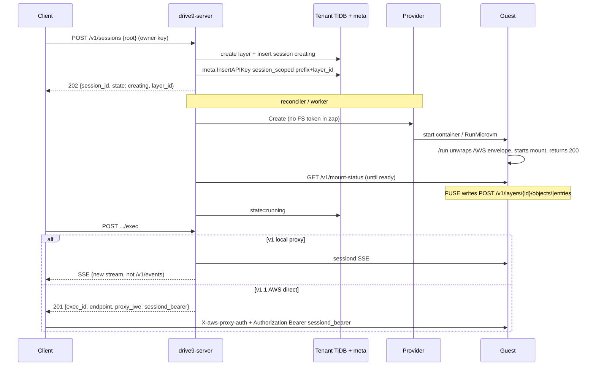

# drive9 Computer：把计算层做成可插拔 Session，而不是第二套存储

| 字段 | 值 |
|------|----|
| **Status** | Draft |
| **Date** | 2026-09-01 |
| **Author** | drive9 team / design-doc-writer |
| **Audience** | drive9 工程 / 产品 |
| **Canonical path** | `docs/design/drive9-computer-session.md` |
| **Revision** | 2026-09-01 r4（ForceUID/ForceGID 让 uid 1000 能写 `/workspace`；`/suspend` 硬事实与 PR9 tags 对齐 drain/`ListMicrovms`；CLI `--hooks`） |

本文是 **产品方向 + 架构** 设计，不是一页功能 spec。目标是把「drive9 不要再只做 Agent 的存储层，计算层也做进来；sandbox 可插拔；v1 先 AWS（也许是 Lambda microVM）」从直觉收成：**可命名的产品、可落地的抽象、可在本仓库实现的薄 v1**，并诚实地区分 Cloudflare-like / Archil-like / 我们自己的第三条路。

---

## Overview

drive9 今天已经是一套 **tenant 隔离、语义可检索、可 FUSE 挂载的网络文件系统**（TiDB/MySQL 元数据 + S3 大文件 + db9 小文件/embedding）。Agent 已经可以 `drive9 mount`、`fs layer`、`vault with`、在 E2B / 云 VM 里当磁盘用。缺的不是「再做一个容器平台」，而是：**在已经索引好的磁盘上唤醒一台电脑**。

本设计把产品扩张定义为：

> **drive9 仍然是 durable、tenant-isolated、semantically searchable 的文件系统（source of truth）。**
> **计算是绑定到某个 drive9 子树的 Session。**
> Session 有：可插拔 sandbox backend、该子树的挂载、生命周期（create / exec / idle-hibernate / destroy）、I/O（stdio，后续 PTY）、策略（网络、资源、timeout、egress）。
> **drive9 不做 PaaS，也不做通用容器编排。**
> 相对 E2B / Modal / Cloudflare 的楔子：**文件系统先于沙箱存在，且活得比沙箱久。Agent 不必 rsync 源码/文档/配置进去；它们在已经索引过的盘上唤醒一台 computer。**
> 楔子 **不** 覆盖 `node_modules` / `target` / `.venv` 这类重建产物——那些在 guest 本地 overlay 里，Suspend 还在，Destroy / 8h 墙后消失。

这既不是 Cloudflare `@cloudflare/computer`（SQLite workspace + isolate/container 双运行时），也不是 Archil（POSIX 网络盘 + `disk.exec` / persistent sandbox，自己几乎不拥有语义层）。它是 **Hybrid**：`SandboxProvider` + `MountProtocol` 可插拔，drive9 **编排** 二者，但 **不拥有单一 runtime**。产品表面走 **storage-primary + compute sidecar**（方案 A），以免把仓库煮成编排器。

**切片纪律（r2）：**

| 版本 | 范围 |
|------|------|
| **v1** | **local provider（Docker/Podman）+ 控制面**（schema、`/v1/sessions`、CLI、Go SDK、`drive9 sessiond`、auto-layer、session-bound token）。不依赖 AWS。可在 `DRIVE9_TENANT_PROVIDER=local` 与 Linux CI 上交付。 |
| **v1.1** | **`aws_lambda_microvm`，且仅在 PR0 FUSE spike 通过之后。** 经典 Lambda Function / Fargate **仍然不是 computer**。 |
| PR0 失败 | 控制面 + local Session **仍然是产品**（Docker 里的 POSIX 电脑）。不要为了 AWS 失败去改产品名。备选 hypervisor（ECS-on-EC2 / 自建 Firecracker）另开设计，不阻塞 v1 merge。 |

**不要把「Lambda microVM」理解成经典 Lambda Function。** 2026 年的 **AWS Lambda MicroVMs** 是独立原语（Firecracker、有状态、suspend/resume、最长 8 小时、inbound HTTPS + JWE）。它是 v1.1 的正确 *类别*，但 **FUSE（`CONFIG_FUSE` / `/dev/fuse` / go-fuse）不是 AWS 合同，只是 `additionalOsCapabilities: ["ALL"]` 的假设**。PR0 是 merge 任何 AWS provider 代码的硬门禁。

---

## Background & Motivation

### 当前产品是什么

[`docs/design-overview.md`](docs/design-overview.md) 把 drive9 定位为 *agent-native data infrastructure*：网络盘 + 内置语义检索。Agent / 人看到的是文件操作：

```bash
drive9 fs cp ./dataset.tar :/data/dataset.tar
drive9 fs cat :/config/settings.json
drive9 mount :/data ~/drive9-data
drive9 fs grep "pricing strategy" /
```

实现上已经远不止「对象存储套一层 API」：

| 能力 | 仓库位置 | 对计算层意味着什么 |
|------|----------|-------------------|
| HTTP FS `/v1/fs/{path}` | `pkg/server/server.go` | Session 里的文件 I/O 必须走同一套 path / auth / quota，禁止第二套文件 API |
| Tenant + API key + scoped FS token | `pkg/server/auth.go`, `pkg/server/tokens.go`, `pkg/server/fs_authorization.go` | 沙箱 **永远不能** 持有 owner key。今天的 `fs_scoped` **不够**：`GET /v1/events` 对 scoped token **永久拒绝**（`isScopedBusinessRequestAllowed`），而 FUSE 失效依赖 `WatchEvents`。Session 需要 **新的 scope kind**，见下文 |
| FUSE（go-fuse/v2），含 `coding-agent` profile、writeback、SSE 失效 | `pkg/fuse/`, `cmd/drive9/cli/mount.go` | 挂载复用现有 mount **代码**，但 **不是** 今天 laptop `coding-agent` 的 drop-in：SSE、layer 绑定、profile、writeback 大小都要改 |
| `GVisorCompat` | `MountOptions.GVisorCompat`, `DRIVE9_MOUNT_GVISOR_COMPAT` | 已经有人为「在沙箱里挂 drive9」付过代价 |
| `--supervise-foreground` | `pkg/mountsupervisor`, `docs/design/fuse-mount-supervision.md` | Guest 里 FUSE 由 **`drive9 sessiond`（PID 1）** spawn 这条路径；禁止 `drive9 mount --foreground` 当 PID 1 |
| `--allow-other` / `user_allow_other` | `cmd/drive9/cli/mount.go`, `pkg/fuse/mount.go`（Linux **总是**再加 `default_permissions`）, `cli/doctor.go` | 没有 `allow_other` 时 uid 1000 **看不见** mount。有了之后内核按 getattr 的 uid/mode 做 POSIX。见下一行 |
| FUSE 报告的 owner | `pkg/fuse/dat9fs.go`：`NewDat9FS` 把 `fs.uid/gid = os.Getuid/Getgid()`；`fillAttr` 无 `HasUID` 时用它们（文件 0644、目录 0755）；`Access()` → `hasPOSIXAccess` | PID 1 是 root ⇒ getattr **uid 0**。uid 1000 vs 0755/0644 的 other-write=0 → **EACCES**（内核 `default_permissions` 与 `Access()` 双杀）。`--allow-other` **不够写**。v1 必须 `ForceUID/ForceGID=1000`（进程仍 root 才能开 `/dev/fuse`）。**不要**为 compute-session 关掉 `default_permissions`/`Access()` |
| Layer FS 写路径 | `pkg/fuse/commit_queue.go`, `pkg/client/fs_layer.go` | **没有** `/v1/fs?layer=` 写。FUSE overlay 写是 `POST/PUT /v1/layers/{id}/objects` 与 `/v1/layers/{id}/entries`。`?layer=` 只出现在 **grep**（`Client.GrepWithLayer`） |
| Layer commit / fork | `pkg/server/fs_layer.go` + `isScopedFSLayerRouteAllowed` | 今天 `fs_scoped` 能 `POST {id}/commit`（handler 只 `authorizeFS(Write, base_root)`）。session token **必须 deny commit**，否则 prompt-injected curl 把 overlay 打进 main |
| Vault + `vault with` | `pkg/vault/`, `pkg/server/vault.go` | Secret 在 **server** 物化。Guest 环境 **不** 复用 `vault with` 的 scrub 表（那张表会剥掉 `DRIVE9_SERVER`） |
| Durable background tasks | `pkg/semantic/task.go`, `semantic_tasks` | Session 是 **实体**（像 `fs_layers`），不是 queue item |
| SSE `/v1/events` | `pkg/server/sse.go`（心跳 **30s**） | **文件系统变更流**。Exec 输出是 **另一条** SSE（session 或 sessiond），不要声称「复用 `/v1/events`」 |
| Git workspace | `/v1/git-workspaces` | `isScopedBusinessRequestAllowed` **不**放行该前缀。**v1 Session cwd 不是 git-workspace 模式**；FUSE 当普通目录挂。v1.x 若要 git fast workspace，必须把那些路由加进 session_scoped allowlist |
| Object STS mint | `pkg/server/object_sts.go` | 「给沙箱发短时凭证」已有模式；AWS 侧还有 **独立的** MicroVM proxy JWE（≤60 min） |
| POSIX 门禁 | `docs/posix-compatibility-report.md`：8941/8941 | 那是 **owner mount + SSE** 的成绩。Session 路径在 SSE + layer-bind + profile 落地前 **不得** 宣称 8941 |
| 对外 skill 已写「sandbox」 | `docs/skills/tidbcloud-aws-ap-southeast-1.md` | 叙事已是「跨 sandbox 的 persistent workspace」——sandbox 还不是我们的。生产入口示例是 `https://aws-ap-southeast-1.drive9.ai/` |

CLI 顶层动词（`cmd/drive9/main.go`）包括 `create / delete / admin / ctx / fs / token / vault / journal / git / region / profile / mount / umount / doctor / update`（以及 pack/unpack handler）。计算层是 **同级新动词** `compute`，`sessiond` 是 **现有 CLI 的子命令**（`drive9 sessiond`），不新增第二个发布矩阵。

### 痛点

1. **Agent 仍然要自己找一台电脑。** 今天的闭环是：人/编排器先有 E2B、EC2、Codespace，再 `drive9 mount`。磁盘是一等公民，电脑是用户自备。
2. **上下文搬运税。** E2B / Modal 默认：create sandbox → upload files → exec → download。drive9 已有 inode、embedding、layer、journal。再 rsync **源码** 是产品失败；重建 `node_modules` 则是预期。
3. **挂载权限分裂。** Archil 写明：Lambda Function / Fargate / 许多 cloud container **不能** 挂 FUSE。drive9 若只说「你自己 mount」，永远受制于对方 sandbox。
4. **Layer / vault / scoped token 没有消费端。** 缺 drive9 自己的执行面。
5. **竞品正在把「computer」定义成产品名词。** Cloudflare Computer（2026-08）、Archil serverless exec + persistent sandboxes、E2B volumes、Lambda MicroVMs（2026-06）。

### 我们不是从零开始

- FUSE `GVisorCompat`
- skill 文档 *E2B sandboxes and cloud VMs*
- Layer V1 用户旅程就是「Start an Agent Work Session」
- FUSE supervision 已经为 sandbox 写过 `--supervise-foreground`

计算层扩张 = **把「电脑」的生命周期收进 drive9 控制面**，而不是重写文件系统。

---

## Goals & Non-Goals

### Goals

1. **命名产品对象。** 一等公民是 **Session**。Sandbox 是 pluggable runtime 实例。File 仍是 durable truth。
2. **可插拔。** `SandboxProvider` 与 `MountProtocol` 正交。drive9-server 编排，不绑定单一 hypervisor。
3. **v1 薄且可测。** 只交付 **local provider + 控制面**，feature flag 默认关。AWS 是 v1.1，PR0 门禁。
4. **安全默认。** Session token 绑定 prefix **和** `layer_id`；不能写 main；不能拿 owner key；secret 走 server 侧 grant 物化。
5. **不破坏现有 FS。** 无 Session 时 `/v1/fs`、FUSE、layer、git workspace、vault、SSE 行为不变。v1 Session **不**启用 git-workspace FUSE 模式。

### Non-Goals

| 不做 | 为什么 |
|------|--------|
| 把 v1 定义成「能在 AWS 上跑的 computer」 | 那是 6 个月产品线。v1 是 Session 控制面 + 本地 POSIX 盒 |
| 通用容器平台 / K8s / 多 region 调度 | 范围陷阱 |
| GPU、自定义 VPC peering、嵌套 Docker | AWS `ALL` capabilities 能开 nested containerd——v1.1 **也不**承诺 |
| Browser computer-use / GUI | 错 ICP |
| 持久公网 IP、preview URL、用户任意 OCI | v2；v1.1 镜像只由 drive9 构建 |
| 把 drive9 文件搬进 SQLite Durable Object | Cloudflare 存储模型 |
| Wasm / isolate 作为 v1 | v2 backend |
| 自建 Firecracker 机房作为 v1 | E2B 的生意 |
| 经典 Lambda Function / Fargate 当 computer | 已否决 |
| `drive9 compute run`（Archil `disk.exec` 语法糖） | **v1 / v1.1 API 表面都不出现** |
| 替换用户「自己 EC2 上 mount」 | 永远合法 |

---

## 产品命题：drive9 要变成什么

### 五种选项

| ID | 命题 | 一等对象 | 像谁 |
|----|------|----------|------|
| **A** | Agent filesystem，可 spawn 一个 cwd=drive9 mount 的 sandbox | File / subtree；Session 附属 | 今天的 drive9 + 编排 |
| **B** | Agent computer，drive9 只是盘 | Session / VM | E2B、Daytona、Codespaces |
| **C** | Cloudflare-like：可编程环境 + 文件系统 | Workspace（SQLite VFS） | `@cloudflare/computer` |
| **D** | Archil-like：POSIX 盘，drive9 **不跑** 计算 | Disk | Archil 加 compute 之前 |
| **E** | Hybrid：可插拔 Provider + MountProtocol，drive9 编排但不拥有 runtime | Session（绑 subtree） | 本设计 |

用户原话：**sandbox 必须可插拔；v1 先 AWS。** 这强制 **E**。为了不 boil the ocean，**产品表面走 A**，**实现切片把 AWS 推到 v1.1**。用户仍然生活在文件和路径里：`compute create --root :/ws` = 「在这块盘上开一台电脑」。

### 我们像谁、不像谁

**像 Archil（存储哲学）：** 机器的身份是数据（[The file system is the sandbox](https://archil.com/post/the-file-system-is-the-sandbox)）。计算是把代码送到盘上。挂载协议与 runtime 分离。

**不像 Archil：** 我们的盘是 inode + 语义检索 + layer + vault + journal，不是 S3 POSIX cache。我们编排 Session。v1 不做 exclusive/shared/conditional disk lock。Archil persistent sandbox 的 TTL 也是 **8 小时量级**（`maxTtlSeconds` 上限 28800）——8h 墙不是 AWS 独有。

**像 Cloudflare Computer（运行时哲学）：** FS 为中心，exec 后端可插拔；harness 与「手」分离。他们希望多数工作走 isolate——那是 Cloudflare 的 **志向，不是 SLA**，我们不把它写成目标。我们的 ICP 要跑真 `git` / `npm` / `go test`。

**不像 Cloudflare：** 权威状态在 tenant TiDB + S3，不是 DO SQLite。

**像 E2B：** 隔离盒 + in-guest agent + bash。  
**不像 E2B：** 盘本来就在；我们是 disk-primary。

### ICP

1. Agent runtime / harness（需要 bash + 文件 + 网络）
2. 已经把工作区放在 drive9 上的团队
3. 多租户 SaaS（后）

### 原子产品对象

| 角色 | 对象 |
|------|------|
| **Primary** | **Session**（`ses_...`） |
| **Secondary** | Sandbox（MicroVM id / Docker cid） |
| **Durable truth** | File tree + Layer（未 commit 则 main 不变） |
| 营销名 | drive9 Computer |
| 禁用做一等对象 | Workspace（已是 git workspace）、Sandbox（实现词） |

CLI：`drive9 compute`。HTTP：`/v1/sessions`。

---

## Prior Art（调研摘要，非记忆）

### Cloudflare Computer / Sandbox / Containers

- [Your agent needs a computer, not a container](https://blog.cloudflare.com/cloudflare-computer/)（2026-08-03）
- [github.com/cloudflare/computer](https://github.com/cloudflare/computer)
- [Containers beta](https://blog.cloudflare.com/containers-are-available-in-public-beta-for-simple-global-and-programmable/)
- [Sandboxes GA](https://blog.cloudflare.com/sandbox-ga/)

Computer = primed FS + 多种 exec 后端。Isolate = just-bash；Container = `computerd` FUSE 投影 SQLite VFS。学 pluggable backend，不学 SQLite-VFS。

### Archil

- [Thesis](https://archil.com/post/the-file-system-is-the-sandbox)
- [Serverless execution](https://docs.archil.com/compute/serverless-execution)
- [Persistent sandboxes](https://docs.archil.com/compute/persistent-sandboxes)（preview 期间 TTL 60–28800s，默认 8h）
- [Containers](https://docs.archil.com/mounting/containers)：Lambda / Fargate / Modal container 往往不能挂 FUSE
- [Firecracker](https://docs.archil.com/guides/virtualization/firecracker)：默认 FC 内核常 **无 FUSE**

### E2B / Modal / Daytona / Fly

E2B：Firecracker + envd；盘默认活在 sandbox。Modal：gVisor 默认。Daytona：偏长活 workspace。Fly Machines：自己当编排器。

### AWS 原语对照

Lambda 产品线里已有 **Functions、Durable Functions、Managed Instances、MicroVMs**。下面只比较「像不像 computer」。**不要**说 MicroVMs 是「第三个」原语。

| 原语 | 时长 | Inbound | FUSE | 状态 | computer？ | 本设计 |
|------|------|---------|------|------|------------|--------|
| Lambda Function | 15 min | 仅 invoke | 否 | 不保证 | **否** | 不用 |
| **Lambda MicroVMs** | **8h（含 suspended）** | HTTPS + JWE；shell 是 **另一套** API | `ALL` **capabilities** 声称能 mount FS；**内核 FUSE 未合同** | suspend 保内存+盘 | **类别正确** | **v1.1 + PR0** |
| Fargate | 无硬顶 | 任务 ENI | **无 privileged / 无 CAP_SYS_ADMIN** | ephemeral | 否 | 不用 |
| ECS on EC2 | 无硬顶 | 可以 | privileged 可以 FUSE | 自管 | 是 | PR0 失败后的备选 |
| EC2 + EBS | 无硬顶 | 任意 | 完全 | 真机 | 是 | 用户已能自己 mount |
| 自建 Firecracker | 任意 | 自己做 | 自己编内核 | 自己做 | 是 | v2 |

来源：[AWS News Blog 2026-06-22](https://aws.amazon.com/blogs/aws/run-isolated-sandboxes-with-full-lifecycle-control-aws-lambda-introduces-microvms/)、[Developer Guide](https://docs.aws.amazon.com/lambda/latest/dg/lambda-microvms-guide.html)、[quotas](https://docs.aws.amazon.com/lambda/latest/dg/gettingstarted-limits.html)、[agent-toolkit SKILL](https://github.com/aws/agent-toolkit-for-aws/blob/main/skills/specialized-skills/serverless-skills/aws-lambda-microvms/SKILL.md)、[Fargate security](https://docs.aws.amazon.com/AmazonECS/latest/developerguide/fargate-security-considerations.html)。

**Lambda MicroVMs 必须写进设计的硬事实（v1.1）：**

- Image **单一尺寸**：memory 在 **CreateMicrovmImage** 时钉死，不在 `RunMicrovm`。vCPU 随 memory 走（2 GiB = 1 vCPU）。默认 **2 GiB / 1 vCPU / 8 GiB disk**；32 GiB disk 只存在于 8 GiB / 4 vCPU baseline（peak 32/16）。**不能**按 Session 要 16 vCPU。
- 配额 400 GiB（部分 region 1024 GiB）是 **RUNNING + SUSPENDED** 的配置内存之和。Hibernate **仍占配额**。`RunMicrovm` 默认 5 TPS。
- 墙钟 `maximumDurationInSeconds` **包含 suspended 时间**，硬顶 8h。Resume **不能**续命。
- AWS idle = **inbound 打到 MicroVM HTTPS endpoint 的流量**，不是「没有 exec」。FUSE I/O 是 **outbound**。Health() 打 sessiond 是 inbound，会阻止 suspend 或把已 hibernate 的盒子每 5s 拉起来。
- Hooks（路径前缀 `/aws/lambda-microvms/runtime/v1/<hook>`，**独立 hook port**）：
  - **`/ready`**（**image build**，1–3600s）：返回 200 时 Lambda **快照**内存+盘。此处 **禁止** mount 租户盘。
  - **`/run`**（`RunMicrovm` 之后，**1–60s，默认 1s，不能调到 60s 以上**）：唯一能收 `runHookPayload`（≤16 KiB）的地方。返回 200 之前流量不转发。失败 → TERMINATING。
  - **`/resume`**：suspend 之后；必须 umount+remount / 丢 HTTP 缓存。
  - **`/suspend`（1–60s）**：**只确认已经 drain**（200 / 未 drain 则 409）。**禁止**在 hook 里刷 FUSE writeback。Drain 是 reconciler 的 `POST /v1/drain`（≤2 min），成功后才 `SuspendMicrovm`。
- 两种 inbound token：**`CreateMicrovmAuthToken`**（应用端口，JWE，**TTL 最大 60 min**）vs **`CreateMicrovmShellAuthToken` + `SHELL_INGRESS`（端口 8022）**。产品 exec **只用前者**。v1.1 生产 Run **不**挂 `SHELL_INGRESS`。
- `executionRoleArn` 挂在 **正在跑的 VM** 上；guest 可走 **IMDSv2** 拿这只角色（Claude sandbox 文档甚至当特性广告）。
- `additionalOsCapabilities: ["ALL"]` 是 Linux **capabilities**（含 CAP_SYS_ADMIN），**不加载内核模块**。Archil：默认 FC 内核经常没有 FUSE。
- 容器基座：`public.ecr.aws/lambda/microvms:al2023-minimal`。OS 镜像 ARN：`arn:aws:lambda:<region>:aws:microvm-image:al2023-1`。两者不是同一个东西。
- ARM64 only。drive9 CLI 已有 linux/arm64。

经典 Lambda Function **淘汰** 为 computer backend。

---

## Proposed Design

### 总架构



控制面拥有 Session 记录与 Provider 调用。数据面文件只走 `/v1/fs` + FUSE。Guest **不是**文件权威。

### 生命周期



**去掉独立的 `idle` 状态。** 「该 suspend 了」是 reconciler 的判断，不是对外状态。对外只有 `creating | running | executing | hibernated | failed | destroying | destroyed`。

**Idle 单所有者 = drive9-server reconciler。** v1.1 调 AWS 时：

- `idlePolicy.maxIdleDurationSeconds` 设到墙钟（或文档允许的最大），`autoResumeEnabled=false`
- **禁止** 让 Lambda 因「没有 inbound」把正在 `npm install`（纯 outbound FUSE）的盒子快照掉
- **禁止** 对 `hibernated` 做 `Health()`（那会 Resume）
- AWS 仍可能在 8h / 账户配额上 TERMINATE：reconciler 用 `Provider.Get` 对账，把行标 `failed`/`destroyed`，**不**自动重建

local provider：Hibernate = **先** `POST /v1/drain`（最多 2min）成功，再 `docker stop -t 120`（≥ drain 预算；默认 10s SIGKILL 会切断 FUSE 半提交）。Resume = `docker start` + 与 `/resume` 相同的 remount。

**Hibernate 不快照 drive9 文件。** 它快照的是 guest 内核、FUSE 连接、writeback、本地 overlay。Drain **不能**放在 AWS `/suspend`（1–60s）里——256 MiB writeback 过 WAN 可以超过 60s，hook 超时后 Lambda 仍可能快照脏状态。Drain 在 reconciler 里完成；`/suspend` 只问「已经 drain 了吗？」→ 200 或 409。`/resume` 必须 umount+remount。否则 go-fuse 会对着已关闭的连接挂死 `stat`。

### Create 是异步的

`POST /v1/sessions` 插入 `creating` 行、入队、立刻 **202** + `session_id`。`Provider.Create` 在 reconciler/worker 里跑，不堵在 API goroutine / LB 超时上。

CLI `drive9 compute create` **默认 `--wait`**：poll `GET /v1/sessions/{id}` 直到 `running|failed`（超时可配，默认 3min）。`--no-wait` 打印 id 就退出。

### Session × Layer × Token × Vault



**默认 auto-layer 是 server 行为，不是 CLI 糖。** Create handler 在同一控制路径里 `fs layer create`；`layer_id` 写入 `compute_sessions`。Owner 可显式 `layer_id`（必须属于同一 `base_root_path` 且 `active`）。**v1 不提供 `--no-layer` / `"layer":"none"`。** 直写 main 是明确的后续产品开关，需要单独安全评审。

**Session token（新 `meta.APIKeyScopeKindSession = "session_scoped"`）：**

今天的积木不够用，必须改 **meta + auth**，不能只写在 tenant `compute_sessions` 上：

- `token.Claims` **没有** `layer_id`（只有 tenant/version/iat/exp/journal_permissions）。不要把 layer 塞进 JWT claims 当权威——权威在 meta DB。
- `tenant_api_key_fs_scopes` 是 `(tenant_id, api_key_id, prefix_hash, ops)`，**无 layer 列**。
- `isValidAPIKeyScopeKind` 只认 `owner` | `fs_scoped`。新 kind 不改这个 switch 会打出 `auth_scope_kind_unsupported`。
- `tenantAuthMiddleware` 只在 `APIKeyScopeKindFS` 时 `ListAPIKeyFSScopes`。`TenantScope` 需加 `BoundLayerID string`。

**meta 存储（PR5，与 create 同一 PR）：**

```sql
-- meta DB, next to tenant_api_keys (1:1 with the session key)
ALTER TABLE tenant_api_keys
  ADD COLUMN bound_layer_id VARCHAR(64) NOT NULL DEFAULT '';
```

`isValidAPIKeyScopeKind` 增加 `session_scoped`。Insert 时 `ScopeKind=session_scoped` 且 `bound_layer_id` 非空。中间件 load 进 `TenantScope.BoundLayerID`。Destroy / revoke 清 key，与今天 `RevokeAPIKey` 相同。

**HTTP allowlist（对着 FUSE 真实流量，禁止发明 `/v1/fs?layer=` 写）：**

FUSE `--layer` 的写路径（`pkg/fuse/commit_queue.go` / `dat9fs.go`）：

- `UploadFSLayerFile` → `POST /v1/layers/{id}/objects?path=&size=&base_revision=&mode=`
- `UpsertFSLayerEntry` → `POST|PUT /v1/layers/{id}/entries`
- 读 overlay：`GET /v1/layers/{id}/entries|objects`
- 读 main 回退：`GET|HEAD /v1/fs/*`（无写）
- 失效：`GET /v1/events`（**仅** session_scoped，且 server 按 prefix 过滤）
- 层元数据：`GET /v1/layers/{bound_id}`、`GET {bound_id}/diff|chain|events`

| 允许（且 path 中的 `{id}` 必须 == `BoundLayerID`） | 拒绝（即使 `authorizeFS(Write, base_root)` 今天会过） |
|---------------------------------------------------|--------------------------------------------------------|
| GET/HEAD `/v1/fs/*`（读；含 grep 的 `?layer=` **读**） | PUT/PATCH/DELETE/POST `/v1/fs/*`（main 写） |
| GET `/v1/events` prefix-filtered | `/v1/sessions*`、`/v1/git-workspaces*`、`/v1/vault*`、`/v1/sql`、`/v1/fork` |
| GET `/v1/layers/{bound_id}` | `POST /v1/layers`（再建一层） |
| GET/POST/PUT `/v1/layers/{bound_id}/entries` | `POST /v1/layers/{any}/commit` —— **这是打穿 main 的洞** |
| GET/POST/PUT `/v1/layers/{bound_id}/objects` | `POST .../rollback`、`.../fork`、`.../checkpoints` |
| GET `/v1/layers/{bound_id}/diff\|chain\|events` | `DELETE /v1/layers/{id}` |
| `POST /v1/layers/{bound_id}/uploads/initiate` 及同层 `{upload_id}/presign-batch\|complete\|abort`（客户端已有，handler 若仍 404 则 FUSE 走 objects POST；allowlist 仍要预留，且 **仅** bound_id） | `/v1/uploads*`、`/v2/uploads*`（那是 **main** 上传，`isScopedV1UploadRouteAllowed` 对普通 fs_scoped 是开的） |
| GET `/v1/layer-checkpoints/{id}` **仅当** checkpoint.LayerID == BoundLayerID | 其它 checkpoint |

实现：`isScopedBusinessRequestAllowed` 对 `session_scoped` **不要** 复用 `isScopedFSLayerRouteAllowed` 的全家桶（它现在放行 commit/fork/rollback/DELETE/`POST /v1/layers`）。新函数 `isSessionScopedRequestAllowed(r, boundLayerID)`。Handler 里再断言 `layer.LayerID == scope.BoundLayerID`，防止用名字解析绕过。

raw token **只**进 guest（`runHookPayload` / docker env 的 **inner JSON**）。create 响应不返回 raw FS token。v1.1 direct exec 的 201 **要**返回 `sessiond_bearer`（client 打 8080 需要它；JWE 只过 AWS proxy）。

TTL ≥ wall clock。Destroy → `meta.RevokeAPIKey`。日志只记 `token_id`。

FUSE argv 必须带 `--layer {bound_id}`。8941 **不**自动继承。

**Vault：** exec 可带 `vault_grant_id`。Server 物化 `@env`，经 sessiond 注入 **子进程**。Guest 常驻环境是另一张表，**不是** `vault with` scrub：

| 注入给 FUSE/sessiond | 禁止 |
|----------------------|------|
| `DRIVE9_SERVER`（PublicURL） | owner `DRIVE9_API_KEY` |
| `DRIVE9_SESSION_TOKEN` | `DRIVE9_VAULT_TOKEN` |
| `DRIVE9_ROOT`, `DRIVE9_LAYER`, `DRIVE9_SESSION_ID` | 任意 KMS/master |

`vault with` 会剥 `DRIVE9_SERVER`——那会弄死 FUSE。不要复用那张名单。

v1 控制面即可做 auto-layer + session token。Vault grant 注入可以同 PR 或紧随其后，但 **不能** 拖到「AWS 都上了再做 layer」。

### 最难的选择：沙箱怎么看见文件

| MountProtocol | v1 | 说明 |
|---------------|----|------|
| **`fuse`** | **唯一** | Guest 内现有 `drive9 mount`。POSIX。需要 `/dev/fuse` |
| `sync` | 否 | copy-in/out；v1.5 burst |
| 其他 | 否 | httpfs/webdav/rclone/virtio-fs/NFS |

**Session 默认 mount profile 必须是代码里的 `coding-agent` 模式表，不能只换名字。**

`defaultCodingAgentLocalOnlyPatterns` **只**在 `profile == "coding-agent"` 时返回 `node_modules`/`.git`/… 列表。其它名字（包括 `"compute-session"`）得到 `nil`。同时 `profileAllowsLocalPolicy("compute-session")` 为 true（不是 `interactive`/`none`）→ local policy **开着但零 pattern** → 全部 `remote_persistent`，等于 `--profile=none`，和「Destroy 后必须再 npm install」相反。

因此 PR4 **必须**改 `pkg/fuse/local_policy.go`：

```go
const MountProfileComputeSession = "compute-session"

func defaultCodingAgentLocalOnlyPatterns(profile string) []string {
    switch profile {
    case MountProfileCodingAgent, MountProfileComputeSession:
        return []string{ /* 现有同一 slice，禁止复制两份 */ }
    default:
        return nil
    }
}
```

- **远程持久：** 源码、文档、配置、非缓存路径上的产物 → layer
- **本地 overlay：** 与 `coding-agent` **同一 slice**（`.git/**`、`node_modules`、`target`、`dist`、`.venv`、cache）。Suspend 还在；Destroy / 8h / 新 Session 会没
- **writeback：** `--write-cache-size-mb 256`
- **`--profile=none`：** 全远程 opt-in
- **pack-on-hibernate：** 不是 v1

`/suspend` **不做** drain。Drain 见 sessiond `POST /v1/drain` + reconciler。

### Guest 启动序列（工程师能照着实现）

**PID 1 = `drive9 sessiond`，没有第三份 guest 二进制。** r2 删掉 `cmd/drive9-sessiond` 后又发明 unnamed supervisor，那是新发布物。sessiond 已经要 spawn FUSE，它可以同时听两个端口。

| 进程 | uid | 端口 | 职责 |
|------|-----|------|------|
| **`drive9 sessiond`（PID 1 / ENTRYPOINT）** | 0 | **0.0.0.0:8080** exec；**0.0.0.0:8021** AWS hook 前缀 | exec、mount-status、drain、hooks；spawn 下一行 |
| **`drive9 mount --supervise-foreground`**（sessiond 的子进程） | 0 开 `/dev/fuse`；getattr **ForceUID/GID 1000** | — | `/workspace` 对 agent 可写 |

Guest 命令（镜像 ENTRYPOINT，也是 local `docker run` 的 command）：

```bash
drive9 sessiond --listen 0.0.0.0:8080 --hooks 0.0.0.0:8021
```

**禁止** `drive9 mount --foreground` 当 PID 1。**禁止** 再做一个 tiny supervisor。

Guest 用户 **`agent`（uid 1000）** 跑 argv。sessiond `setuid` 到 agent 再 `exec`。`agent` 不能杀 PID 1。

**FUSE 对 uid 1000（可见 ≠ 可写）：**

1. 无 `allow_other`：只有 mounter 看见 mount → `ls` 也 EACCES。
2. `--allow-other` 在 Linux **总是**附加 `default_permissions`（`pkg/fuse/mount.go`）。
3. `NewDat9FS`：`fs.uid = os.Getuid()`（sessiond 是 0）。`fillAttr` 默认把文件/目录报成 **uid 0 + 0644/0755**。`Access()` 用 `hasPOSIXAccess`：caller 1000 ≠ owner 0，other-write 关 → **EACCES**。内核 `default_permissions` 同样拒绝。新文件只有 create **成功之后** 才会 `UpdateOwner(..., header.Uid)`——create 过不了。
4. `/dev/fuse` 仅 root ⇒ 不能把 FUSE 子进程降到 1000 来绕过。

**裁决：PR4 增加 `MountOptions.ForceUID` / `ForceGID`（CLI `--force-uid/--force-gid`）。** `NewDat9FS` 若设置则 `fs.uid/gid` 用它们，进程仍是 root。getattr 报 1000，0755 目录的 owner-write 让 agent 能建文件。**保留** `default_permissions` 与 `Access()`（不要为 compute-session 关 POSIX）。没有现成 `--uid` flag，必须新做。

Dockerfile **必须**：

```
echo user_allow_other >> /etc/fuse.conf
# fusermount：去掉 setuid 或 chmod 750 /usr/bin/fusermount* 仅 root
# /dev/fuse：仅 root 可写（sessiond 以 root mount）
```

**精确 mount argv**（`/run` 在后台 spawn；变量来自 inner payload）：

```bash
drive9 mount --supervise-foreground \
  --allow-other \
  --force-uid 1000 --force-gid 1000 \
  --profile=compute-session \
  --layer "${DRIVE9_LAYER}" \
  --write-cache-size-mb 256 \
  ":${DRIVE9_ROOT}" /workspace
```

（`--allow-other` 需要 `user_allow_other`。`--force-uid/gid` 需要 PR4 的 `MountOptions.ForceUID/ForceGID`。`--profile=compute-session` 需要 `MountProfileComputeSession`。）

**AWS 镜像快照（`/ready`）：** fuse3、ca-certificates、linux/arm64 `drive9`、`agent` 用户、`user_allow_other`、sessiond 已在 8080 **和** 8021 listen、**未** mount。`GET /aws/lambda-microvms/runtime/v1/ready` → 探 8080 `/healthz` → 200。零租户密钥。基座 `public.ecr.aws/lambda/microvms:al2023-minimal`；OS ARN `arn:aws:lambda:<region>:aws:microvm-image:al2023-1`。尺寸钉死 2 GiB / 1 vCPU / 8 GiB。`ALL` capabilities 仍是 FUSE **假设**。

**local：** 同一 Dockerfile。`docker run --name drive9-ses-${SESSION_ID} --device /dev/fuse --cap-add SYS_ADMIN -p 8080 -p 8021 ...`

**AWS `/run` HTTP 体是 envelope，不是 inner JSON。** `RunMicrovm --run-hook-payload` 是 **≤16 KiB string**。Hook POST（`microvms-launching.html`）：

```json
{ "microvmId": "mvm-…", "runHookPayload": "<string, inner JSON>" }
```

sessiond **必须**：`json.Decode` envelope → `json.Unmarshal([]byte(runHookPayload), &inner)`。对 inner 直接 Decode 的实现会在每次真 `RunMicrovm` 上校验失败。

local 假 `/run` **用同一 envelope**。`docker -e DRIVE9_SESSION_PAYLOAD='{inner JSON}'` 是 **inner 字符串**，不是 envelope；sessiond 在无 POST 时读该 env 当 inner。

**inner schema（`runHookPayload` 字符串的内容）：**

```json
{
  "server": "https://drive9.example",
  "session_id": "ses_...",
  "root": "/workspace/",
  "layer_id": "lyr_...",
  "session_token": "<raw, never logged>",
  "sessiond_bearer": "<random>",
  "profile": "compute-session",
  "write_cache_mb": 256
}
```

**`/run`（≤60s）：** unwrap envelope → 写 `/run/drive9-session.env`（0600 root）→ **start** 上面那条 mount argv（后台）→ `mount_pending` → **立刻 200**。不等 FUSE ready。

**sessiond 路由：**

```
GET  /healthz
GET  /v1/mount-status          → {state: pending|ready|failed, error?}
POST /v1/exec                  409 if mount not ready；SSE + 15s heartbeat
POST /v1/drain                 阻塞直到 FUSE commit queue 空或 timeout
                               默认 timeout 120s；busy 时拒绝新 exec
                               成功 → drained=true；失败 → 409 {error: drain_failed}
GET  /aws/lambda-microvms/runtime/v1/ready
POST /aws/lambda-microvms/runtime/v1/run      # envelope
POST /aws/lambda-microvms/runtime/v1/resume
POST /aws/lambda-microvms/runtime/v1/suspend  # 见下，不是 drain
```

`POST /v1/exec` 在 `mount_pending` 或 drain 中 → 409。reconciler **poll** `GET /v1/mount-status`（方向：server → guest），直到 ready 才标 `running`。3min → `failed` + Destroy。

**Drain vs `/suspend`（不要混）：**

| 谁 | 做什么 | 时限 |
|----|--------|------|
| Reconciler | `POST http://guest:8080/v1/drain` | 最长 **2 min** |
| drain 成功 | 再 `SuspendMicrovm` / `docker stop -t 120` | |
| drain 失败 | **Destroy**，**不要** `SuspendMicrovm` | |
| AWS `POST .../suspend` | **只**检查 `drained==true`：是 → 200；否 → **409**（让 reconciler 别进 Suspend）。**禁止**在 hook 里做 WAN writeback | **1–60s**，默认 1s |
| local | 无 AWS hook；仍先 drain 再 `docker stop -t 120` | docker 默认 10s 会 SIGKILL FUSE |

**`/resume`：** root `fusermount -u /workspace`（agent 调不到）→ 丢 HTTP 客户端 → 再 spawn 同一 mount argv → 200 可在 mount **启动后**返回；sessiond 再 `mount_pending`。不得假设旧 TCP/HTTP2。

**Windows/macOS CLI** 只当控制面。Guest 永远 linux。

**失败 → 状态：**

| 失败 | Session state |
|------|----------------|
| `RunMicrovm` / `docker run` 错 | `failed` |
| `/run` 非 200 / timeout | AWS → TERMINATING；我们 `failed` |
| mount 3min 未 ready | `failed` + Destroy |
| drain 失败 | Destroy，不 hibernate |
| `ListMicrovms`/`docker ps` 里没有对应 id | `destroyed`/`failed` |
| 8h 墙 | `ErrSessionExpired`；`destroyed` |

### 控制面包结构

```
pkg/compute/           # 类型、Provider 接口、local、aws（v1.1）
pkg/compute/sessiond/  # guest 协议的 client + server 实现（供 CLI 子命令调用）
pkg/datastore/         # compute_sessions / compute_execs CRUD（与 fs_layer 一致，不另起 store.go）
pkg/tenant/schema/compute.go
pkg/server/compute_session.go
pkg/client/compute.go
cmd/drive9/cli/compute.go
cmd/drive9/cli/sessiond.go   # `drive9 sessiond` — 进现有 build-cli-release
images/compute-agent/Dockerfile   # PR4 就进，不放到 AWS PR
```

**不** 新增 `cmd/drive9-sessiond`。

CRUD 在 `pkg/datastore`。`NewRegistry(cfg Config) (*Registry, error)` 是具体类型，不是空 struct 注释。

Sentinel：`ErrNotFound`、`ErrNotRunning`、`ErrMountNotReady`、`ErrMountFailed`、`ErrExecTimeout`、`ErrForbidden`、`ErrSessionExpired`、`ErrSessionNameAmbiguous`、`ErrProviderBusy`。

### 核心 Go 接口

```go
package compute

// Package compute: pluggable sandbox sessions bound to drive9 subtrees.

type ProviderName string

const (
    ProviderLocal            ProviderName = "local"
    ProviderAWSLambdaMicroVM ProviderName = "aws_lambda_microvm" // v1.1
)

type MountProtocol string

const (
    MountFUSE MountProtocol = "fuse"
)

type SessionState string

const (
    StateCreating   SessionState = "creating"
    StateRunning    SessionState = "running"
    StateExecuting  SessionState = "executing"
    StateHibernated SessionState = "hibernated"
    StateFailed     SessionState = "failed"
    StateDestroying SessionState = "destroying"
    StateDestroyed  SessionState = "destroyed"
)

// NetworkPolicy is informational in v1. Ingress is always sessiond.
// Egress on local = docker network; on AWS v1.1 = INTERNET_EGRESS or none.
// There is no AWS L7 "https-only" connector — do not put "https" in the public JSON.
type NetworkPolicy struct {
    Egress string // "none" | "internet"
}

type IdlePolicy struct {
    IdleAfter    time.Duration // default 15m → Suspend
    HibernateFor time.Duration // default 2h then Destroy
    MaxWallClock time.Duration // local default 24h; AWS cap 8h
}

// CreateRequest is passed to Provider.Create.
// SessionToken / SessiondBearer MUST NOT be logged (zap.String omits; never zap.Any the struct).
type CreateRequest struct {
    SessionID      string
    TenantID       string
    RootPath       string // CanonicalizeDir
    LayerID        string // required in v1
    Image          string
    Mount          MountProtocol
    Network        NetworkPolicy
    Idle           IdlePolicy
    Env            map[string]string // non-secret
    ServerURL      string
    SessionToken   string // secret
    SessiondBearer string // secret
    Extra          map[string]string
}

type Sandbox struct {
    ProviderID string
    Endpoint   string // http(s)://host:8080 — published port or MicroVM URL
}

type ExecRequest struct {
    ExecID  string
    Argv    []string
    Env     map[string]string // already materialized secrets from server
    Cwd     string            // relative to /workspace
    Timeout time.Duration
    // no Stdin in v1; no Privileged field in v1 JSON
}

type Provider interface {
    Name() ProviderName
    Create(ctx context.Context, req CreateRequest) (*Sandbox, error)
    Get(ctx context.Context, providerID string) (*Sandbox, error) // missing → ErrNotFound
    // Exec is used by the server-proxy path (v1 local). AWS v1.1 CLI/SDK may
    // skip this and talk to sessiond directly.
    Exec(ctx context.Context, sandbox *Sandbox, bearer string, req ExecRequest, w ExecEventWriter) error
    Suspend(ctx context.Context, sandbox *Sandbox) error
    Resume(ctx context.Context, sandbox *Sandbox) error
    Destroy(ctx context.Context, sandbox *Sandbox) error
    // Health MUST NOT be called on hibernated sandboxes (AWS would auto-resume
    // if idlePolicy were on; we still skip to keep one idle owner).
    Health(ctx context.Context, sandbox *Sandbox) error
}

type ExecEventWriter interface {
    Write(ctx context.Context, ev ExecEvent) error
}

type Config struct {
    DefaultProvider ProviderName
    Local           LocalConfig
    AWS             AWSConfig // empty in v1
    Logger          *zap.Logger
}

func NewRegistry(cfg Config) (*Registry, error)
```

`CreateRequest` 的 secret 字段在类型注释里标明；log 只用 `session_id` / `tenant_id` / `provider` / `root_path` / `layer_id`。

### `drive9 sessiond`

PID 1。`--listen 0.0.0.0:8080 --hooks 0.0.0.0:8021`。路由见 Guest 启动序列（含 `POST /v1/drain` 与 AWS hook 前缀）。认证：`sessiond_bearer`（不是 FS token）。exec：`os/exec`、`Dir=/workspace/<cwd>`、credential `agent`、进程组超时 SIGKILL。无 PTY。无 stdin。stdout 不进 server 日志。

Exec SSE heartbeat **15s**（本流）。`/v1/events` 仍是 **30s** fs changelog。

### Exec 数据路径（两条，写进 KD）

| | **v1 local（默认）** | **v1.1 AWS（默认）** |
|--|----------------------|----------------------|
| 路径 | Client → drive9-server → sessiond SSE → client | Client → drive9-server **只**授权并 mint JWE → client **直连** MicroVM sessiond |
| 原因 | Docker 发布端口简单；server 与盒同 VPC/本机 | 避免把 10min `go test` 钉在 API goroutine / LB 上 |
| 限制 | 每进程 max 32 条并发 proxy exec；HTTP timeout = exec timeout+30s；JSON 非流式 **最多等 30s**（超时请用 SSE） | `CreateMicrovmAuthToken` TTL ≤ 60min，**每 ≤30min 刷新**；长 exec 期间 CLI 负责 refresh 或一次 token 覆盖 timeout |
| 断开 | 杀 guest 进程组 | 同 |

**不要**说复用 `/v1/events`。那是 fs 变更日志，scoped 默认还进不去。Exec SSE 是新路由：

- proxy 模式：`POST /v1/sessions/{id}/exec` + `Accept: text/event-stream`
- direct 模式：`POST /v1/sessions/{id}/exec` → `201 {exec_id, endpoint, proxy_jwe, sessiond_bearer}`。**client 必须两个头**：`X-aws-proxy-auth: <proxy_jwe>`（过 AWS L7 proxy）**和** `Authorization: Bearer <sessiond_bearer>`（sessiond 自己的认证）。bearer 在盒内也有一份，但 **owner CLI/SDK 直连 8080 需要再拿到它**——201 返回给 owner 是对的，不是泄漏。server 把 bearer 存在 `creds_ciphertext`，不要让 guest 再吐出来。

Agent 若只会打 drive9-server：v1.1 仍提供 **短** proxy（JSON 30s / SSE 最长 120s）以免简单脚本废掉；长任务必须 direct。

### AWS Lambda MicroVMs provider（仅 v1.1）

```
DRIVE9_COMPUTE_ENABLED=true
DRIVE9_COMPUTE_DEFAULT_PROVIDER=local          # 生产打开 AWS 时显式设
DRIVE9_COMPUTE_AWS_REGION=                      # 默认 = 该租户 drive9 所在 region
                                                # 禁止默默 us-west-2（FUSE 会跨太平洋）
DRIVE9_COMPUTE_AWS_IMAGE_ARN=arn:aws:lambda:<region>:...:microvm-image:drive9-agent
DRIVE9_COMPUTE_AWS_EGRESS=INTERNET_EGRESS       # 或 none；不是 "https"
DRIVE9_COMPUTE_AWS_EXECUTION_ROLE_ARN=          # 默认空
DRIVE9_COMPUTE_MAX_SESSIONS_PER_TENANT=2
DRIVE9_COMPUTE_DEFAULT_IDLE=15m
DRIVE9_COMPUTE_DEFAULT_HIBERNATE=2h
DRIVE9_COMPUTE_KILL=                            # terminate_all 不依赖 ENABLED
```

映射：

| drive9 | AWS |
|--------|-----|
| Create | `RunMicrovm` + `--run-hook-payload` **string**（inner JSON）；ingress **仅 8080**（`CreateMicrovmAuthToken`）；**无** `SHELL_INGRESS`；egress `INTERNET_EGRESS` 或 none；idlePolicy 关；`maximumDurationInSeconds=28800`。**不要**对 running MicroVM 设 tag——当前文档的 tags 在 **CreateMicrovmImage** / `TagResource` 的 `microvmImage` 上，`RunMicrovm` 没有 `--tags` |
| Get | `GetMicrovm` |
| List/sweep | **`ListMicrovms` ∩ `compute_sessions.provider_sandbox_id`**。终止集合差里、且 image ARN 是我们的、且状态非终态的孤儿。不要「按 tag Terminate」 |
| Exec | 直连 8080：`X-aws-proxy-auth` + `Authorization: Bearer <sessiond_bearer>`。不用 `CreateMicrovmShellAuthToken` |
| Health | 仅 `running`/`executing` |
| Hibernate | reconciler `POST /v1/drain` 成功 **之后** 才 `SuspendMicrovm`。`/suspend` hook 只确认 drained |
| Resume | `ResumeMicrovm` → guest `/resume` remount。Get 空 → `ErrSessionExpired` |
| Destroy | `TerminateMicrovm` + meta revoke |

**IMDS / 角色：** 默认 **不设** `executionRoleArn`（AWS 标 optional）。若必须写 CloudWatch logs，角色 **仅** `logs:CreateLogStream` / `PutLogEvents` 到指定 log group，**永不** `lambda:*`、`s3:*`、`sts:AssumeRole`。镜像内 **block IMDS**（nft/iptables 拒绝 `169.254.169.253/169.254.169.254`，含 IMDSv2 hop）。这是 PR0 安全清单的一部分。

**Egress「https only」：** AWS **没有** 这种 connector。v1.1 公开枚举只有 `none | internet`。镜像可加 nft 出站 443 allowlist 作为纵深，但不要在 API 里假装有 L7 connector。默认 `internet`（agent 需要 github/npm）；滥用靠账户预算 + 每租户 session cap，不是靠假的 `"https"` 字段。

**资源：** 无 per-session `resources` JSON。换尺寸 = 换 image ARN（v1.1 只有一个 ARN）。

**托管账户：** v1.1 用 drive9 账户。这 **不像** 今天的 S3：每个 Session 是带网的 Firecracker。见「Cost & Abuse」。BYOA 不在 v1.1。

### Local provider（v1）

- `docker run --name drive9-ses-${SESSION_ID} --device /dev/fuse --cap-add SYS_ADMIN` + 同一镜像 ENTRYPOINT `drive9 sessiond ...`
- Hibernate = drain 成功后 `docker stop -t 120`（丢内存）
- 孤儿：`docker ps -a --filter name=drive9-ses-` 减去 `provider_sandbox_id`
- `DRIVE9_COMPUTE_LOCAL_MOUNT=bind`：**仅 laptop**。CI e2e 必须 Linux + `/dev/fuse`

### Reconciler（leader-gated，`pkg/leader`）

不要用 `semantic_tasks`。循环 ~5s：

1. `creating` 超时 3min → `failed` + Destroy
2. `running` 且 idle 且无 in-flight exec → **`POST /v1/drain`（≤2min）**；失败 → Destroy；成功 → `Suspend` / `docker stop -t 120` → `hibernated`
3. `hibernated` 超过 `hibernate_for` 或 wall → Destroy
4. `running`/`executing`：`Get` + `Health`；连续失败 → `failed`
5. **`hibernated`：只 `Get`，不 Health**
6. `Get`/`ListMicrovms` 对账：provider 侧没了 → `destroyed`/`failed` + revoke
7. 定期 `ListMicrovms`（AWS）/ `docker ps`（local）扫 **不在** `provider_sandbox_id` 集合里的、属于我们 image/name 前缀的孤儿 → Terminate
8. 进程重启：加载非终态行，`Get` 对账

Exec **不**进 embedding 队列。v1 断开 = 杀进程组。

Kill-switch：`DRIVE9_COMPUTE_KILL=terminate_all` 即使 `ENABLED=false` 也 Destroy 所有非终态 Session（回滚/事故用）。

---

## API / Interface Changes

mux（`/v1/sessions` 今日未占用）：

```
mux.Handle("/v1/sessions", business)
mux.Handle("/v1/sessions/", business)
```

Owner 管理 Session。`isScopedBusinessRequestAllowed`：**deny** `/v1/sessions*`。`session_scoped` 走 **`isSessionScopedRequestAllowed`**（见上表），**不要**复用 `isScopedFSLayerRouteAllowed`（那会放行 commit）。Create/destroy 走 `ownerScopeFromRequest`。`POST .../hibernate` 在 server 侧同样先 drain 再 Suspend。

| 方法 | 路径 | 说明 |
|------|------|------|
| `POST` | `/v1/sessions` | **202** creating |
| `GET` | `/v1/sessions` | list |
| `GET` | `/v1/sessions/{id}` | 状态（CLI wait 靠这个） |
| `DELETE` | `/v1/sessions/{id}` | destroy |
| `POST` | `/v1/sessions/{id}/exec` | 见上表 proxy vs direct |
| `POST` | `/v1/sessions/{id}/hibernate` | 显式 Suspend |
| `POST` | `/v1/sessions/{id}/resume` | Resume + remount；8h 尽 → **409** `session_expired`，**不是**续命 |

无 `/v1/sessions/{id}/logs` 于 v1（避免假实现）。无 `compute run`。

创建请求（v1 无 `resources`、无 `https` egress、无 `layer: none`）：

```json
{
  "root_path": "/workspace/",
  "provider": "local",
  "name": "fix-auth",
  "idle": { "idle_after_seconds": 900, "hibernate_for_seconds": 7200 }
}
```

响应 202：

```json
{
  "session_id": "ses_01J...",
  "name": "fix-auth",
  "state": "creating",
  "provider": "local",
  "root_path": "/workspace/",
  "layer_id": "lyr_...",
  "mount_protocol": "fuse",
  "workspace_path": "/workspace",
  "created_at": "2026-09-01T00:00:00.000Z"
}
```

`exec` body：

```json
{
  "argv": ["git", "status"],
  "cwd": ".",
  "timeout_seconds": 120,
  "vault_grant_id": ""
}
```

JSON 非流式：最多 **30s**；否则 504，请用 SSE。SSE heartbeat **15s**（本流）；与 `/v1/events` 的 30s **无关**。

取消 client = 杀进程组。

### CLI

```
drive9 compute create [--provider local] [--name fix-auth] [--wait|--no-wait] :/workspace
drive9 compute ls
drive9 compute status <id|name>     # 重名 → ErrSessionNameAmbiguous，与 layer 一样
drive9 compute exec <id|name> -- git status
drive9 compute exec <id|name> --sse -- bash -lc 'npm test'
drive9 compute hibernate <id>
drive9 compute resume <id>          # 不延长墙钟
drive9 compute destroy <id>
drive9 sessiond [--listen 0.0.0.0:8080 --hooks 0.0.0.0:8021]   # guest ENTRYPOINT，不进用户手册首页
```

`exec` exit code 透传。`--no-layer` **不存在**。

### Go SDK

```go
func (c *Client) CreateSession(ctx context.Context, req CreateSessionRequest) (*Session, error) // 202 体
func (c *Client) WaitSession(ctx context.Context, id string) (*Session, error)
func (c *Client) GetSession(ctx context.Context, id string) (*Session, error)
func (c *Client) ListSessions(ctx context.Context) ([]Session, error)
func (c *Client) DestroySession(ctx context.Context, id string) error
func (c *Client) ExecSession(ctx context.Context, id string, req ExecSessionRequest) (*ExecResult, error) // ≤30s JSON
func (c *Client) ExecSessionStream(ctx context.Context, id string, req ExecSessionRequest, h func(ExecEvent) error) error
```

v1 只保证 Go SDK + CLI。

### Agent bash tool

Harness 在任务边界 `create`/`destroy`。每个 bash 调用 = `compute exec`，**不是**新 MicroVM。

---

## Data Model Changes

**两处 schema：** tenant-local 表进 `pkg/tenant/schema/compute.go` + dump-init-sql；**meta** 表改动进 `pkg/meta`（`isValidAPIKeyScopeKind`、`tenant_api_keys.bound_layer_id`）。CRUD 在 **`pkg/datastore`**（tenant 行）+ `pkg/meta`（key）。

**meta（PR5，缺了 session token 会 403 `unsupported API key scope kind`）：**

```sql
ALTER TABLE tenant_api_keys
  ADD COLUMN bound_layer_id VARCHAR(64) NOT NULL DEFAULT '';
```

`APIKeyScopeKindSession = "session_scoped"`。`TenantScope.BoundLayerID`。`token.Claims` **不**加 layer_id。`tenant_api_key_fs_scopes` 仍只存 prefix+ops；layer bind 在 key 行上 1:1。

```sql
CREATE TABLE IF NOT EXISTS compute_sessions (
  session_id          VARCHAR(64) PRIMARY KEY,
  name                VARCHAR(255) NOT NULL DEFAULT '',
  state               VARCHAR(32)  NOT NULL DEFAULT 'creating',
  provider            VARCHAR(64)  NOT NULL,
  provider_sandbox_id VARCHAR(256) NOT NULL DEFAULT '',
  provider_endpoint   TEXT         NOT NULL,
  mount_protocol      VARCHAR(32)  NOT NULL DEFAULT 'fuse',
  root_path           VARCHAR(512) NOT NULL,
  root_path_hash      VARCHAR(64)  NOT NULL DEFAULT '',
  layer_id            VARCHAR(64)  NOT NULL, -- v1 required
  image_ref           VARCHAR(512) NOT NULL DEFAULT '',
  network_json        JSON         NULL,
  idle_json           JSON         NULL,
  token_id            VARCHAR(64)  NOT NULL DEFAULT '', -- meta API key id
  creds_ciphertext    BLOB         NULL, -- sessiond bearer + (v1.1) proxy material; pkg/encrypt
  last_error          TEXT         NULL,
  last_exec_at        DATETIME(3)  NULL,
  last_health_at      DATETIME(3)  NULL,
  actor_id            VARCHAR(255) NOT NULL DEFAULT '',
  created_at          DATETIME(3)  NOT NULL DEFAULT CURRENT_TIMESTAMP(3),
  updated_at          DATETIME(3)  NOT NULL DEFAULT CURRENT_TIMESTAMP(3) ON UPDATE CURRENT_TIMESTAMP(3),
  destroyed_at        DATETIME(3)  NULL
);
CREATE INDEX idx_compute_sessions_state ON compute_sessions(state, updated_at);
CREATE INDEX idx_compute_sessions_root  ON compute_sessions(root_path_hash, state);
CREATE INDEX idx_compute_sessions_name  ON compute_sessions(name, updated_at);

CREATE TABLE IF NOT EXISTS compute_execs (
  exec_id        VARCHAR(64) PRIMARY KEY,
  session_id     VARCHAR(64) NOT NULL,
  actor_id       VARCHAR(255) NOT NULL DEFAULT '',
  vault_grant_id VARCHAR(64)  NOT NULL DEFAULT '',
  argv_json      JSON         NOT NULL,
  cwd            VARCHAR(1024) NOT NULL DEFAULT '.',
  state          VARCHAR(32)  NOT NULL,
  exit_code      INT          NULL,
  error_text     TEXT         NULL,
  started_at     DATETIME(3)  NOT NULL DEFAULT CURRENT_TIMESTAMP(3),
  finished_at    DATETIME(3)  NULL,
  bytes_out      BIGINT       NOT NULL DEFAULT 0,
  INDEX idx_compute_execs_session (session_id, started_at)
);
```

**名字：** 不加 SQL UNIQUE（空 name 合法）。Store 在 insert 时：非空 name 在 `destroyed_at IS NULL` 中冲突 → `ErrSessionNameAmbiguous`。CLI `status <name>` 同层 layer 的歧义行为。

**跨库：** `token_id` 指向 **meta** API key。Destroy / tenant delete 必须 `RevokeAPIKey`，只删 tenant 行会留下能打 `/v1/fs` 的密钥。

无 `tenant_id` 列（库已是 per-tenant）。无 `resources_json`。

Quota：v1 硬编码 `DRIVE9_COMPUTE_MAX_SESSIONS_PER_TENANT`（默认 2），**含 hibernated**。vCPU-seconds 不是 v1。

**Tenant delete：** 接到现有异步删除 worker（`pkg/server/tenant_delete.go`）**在 schema drop / S3 GC 之前**：List 非终态 Session → Destroy（`TerminateMicrovm` by `provider_sandbox_id` + `ListMicrovms` 差集；local `docker rm` `drive9-ses-*`）→ revoke tokens → 再继续今天的删除。失败则阻塞删除。

---

## Cost & Abuse（v1.1 上 AWS 的前置条件；无此页不 ship 托管账户）

这 **不是** 「和今天 S3 一样」。每个 Session = 联网 Firecracker + `ALL` capabilities 假设。

必须有：

1. **Image 标签**（`CreateMicrovmImage.tags` / `TagResource` on `microvmImage`）做成本分摊。Running MicroVM **没有** tag API——孤儿扫用 `ListMicrovms` ∩ DB `provider_sandbox_id`。
2. **账户 AWS Budget + CloudWatch 账单告警**（running 秒、快照存储、egress）。Image 版本 **零 MicroVM 也产生存储费**。
3. **每租户 cap**（含 hibernated）。账户级 memory quota：200 × 2 GiB = 400 GiB 默认顶。Hibernate **不能** 当「免费无限」。
4. **`RunMicrovm` 5 TPS** 是账户全局——create 要排队/429，不要对用户伪装无限弹性。
5. **Kill-switch** `DRIVE9_COMPUTE_KILL=terminate_all` 不依赖 ENABLED。
6. **Compute region = 租户 drive9 region。** 生产 skill 是 `aws-ap-southeast-1`；跨 region FUSE 是产品缺陷。
7. **无 per-tenant egress 美元 cap 时不宣称安全默认「https」。** 默认 internet + 预算。
8. 粗算「美分～角」**删除**。上线前用当时 Lambda MicroVMs SKU 填一页内部报价；没有 SKU 就不对客户承诺比 E2B 便宜。

---

## Alternatives Considered

1. **经典 Lambda Function** — 否。15m、无 inbound、无 FUSE。
2. **Fargate** — 否。无 privileged / SYS_ADMIN。
3. **ECS on EC2** — PR0 失败后的备选，不是 v1。
4. **自建 Firecracker** — v2。
5. **只做 D（不跑计算）** — 用户要计算层。
6. **做成 B（Session 一等、盘降级）** — 丢掉差异化。
7. **先做 isolate/Wasm** — 跑不了 `go test`。
8. **copy-in 代替 FUSE** — 大树与一致性。
9. **v1 直接含 AWS** — 否（本修订）。控制面过大且 AWS 细节在纸面上是错的。
10. **让 AWS idlePolicy 管休眠** — 否。与 outbound FUSE / Health() 冲突。

---

## Security & Privacy

| Actor | 计算层 |
|-------|--------|
| Owner | 开/关 Session，commit layer |
| Agent | POSIX 在 `/workspace`（layer）+ 网络策略；不能拿 owner key、不能写 main、不能 IMDS 拿管理角色 |
| Prompt 注入 | 同 agent |
| 其他租户 | 碰不到 MicroVM/盘/token |
| Guest 内 IMDS | **一等威胁**（不是 breakout） |

硬规则：

1. Guest 永不持有 owner API key。Session token 绑定 prefix **和** meta `bound_layer_id`。**deny `POST /v1/layers/{id}/commit`**（以及 fork/rollback/DELETE/`POST /v1/layers`）。FUSE 写只走 `{bound_id}/objects|entries`。Destroy 吊销 meta key。
2. v1 无 `--no-layer`。Owner commit layer 用 **owner key**（laptop / `drive9 fs layer commit`），不是 guest token。
3. Secret：server 物化 grant；独立 env 名单；不复用 `vault with` scrub。
4. sessiond（PID 1, uid 0）与 agent（uid 1000）分 uid。FUSE `--allow-other` + `user_allow_other` + **`--force-uid 1000 --force-gid 1000`**（否则 `Access()`/`default_permissions` 对 0755 root 目录 EACCES）。`fusermount` 非 setuid；`/dev/fuse` 仅 root。
5. **无 execution role** 或 logs-only + **禁 IMDS**。永不 `lambda:*` on `*`。
6. v1.1 生产无 `SHELL_INGRESS`。
7. Egress API：`none|internet`。没有假的 https connector。
8. 镜像仅 drive9 构建。`ALL` capabilities 是 FUSE 假设，不是「给 agent 嵌套 docker」。
9. 审计：`compute_execs` 记 `actor_id`、`argv_json`、`vault_grant_id`。stdout 不进 server 日志。
10. SSRF：session token 打不了 `/v1/admin/*`、`/v1/provision`、`/v1/tokens`、`/v1/sessions`、`/v1/git-workspaces*`、`/v1/uploads*`（main）。
11. Proxy JWE ≤60 min，刷新 ≤30 min。FS token TTL ≥ wall clock。

---

## Observability

用已有 `RecordTenantGauge` / `RecordTenantGaugeWithOrg`（**有** tenant label，不要再写「若 gauge 不支持 label」）。

```
drive9_service_operations_total{component="compute", operation=create|exec|destroy|suspend|resume|health}
drive9_service_operation_duration_seconds{component="compute", ...}
RecordTenantGaugeWithOrg(..., "compute", "sessions_running"|"sessions_hibernated"|"sessions_creating", n)
```

日志：`compute_session_create` / `_state` / `_exec_start` / `_exec_finish` / `_mount_failed` / `_provider_error`。禁止 token / bearer。

Alert：无 leader；`creating` 堆积；session cap；AWS 5xx/throttle；墙钟接近 8h；账单预算。

---

## Rollout

```
DRIVE9_COMPUTE_ENABLED=false
DRIVE9_COMPUTE_DEFAULT_PROVIDER=local
DRIVE9_COMPUTE_KILL=
```

| 阶段 | 内容 |
|------|------|
| **v1** | local + API/CLI/schema/sessiond/auto-layer/session token/events allowlist/Linux fuse e2e。flag 默认关 |
| **PR0** | AWS FUSE+hooks+IMDS+idle 实测。失败则 v1.1 不开始 |
| **v1.1** | AWS provider + 托管账户成本页 + soak e2e + direct exec + region 对齐 |
| v1.2 | vault grant 若未进 v1；pack overlay；JSON/SSE 打磨 |
| v2 | E2B provider、Firecracker、Wasm、preview URL、用户 OCI（若产品允许） |

回滚：关 ENABLED；`COMPUTE_KILL=terminate_all` 清盒。表可留。

---

## 风险

| 风险 | 严重度 | 缓解 |
|------|--------|------|
| 变成编排器 | 高 | v1 无 AWS 也能 ship；non-goals |
| MicroVM 内核无 FUSE | 高 | PR0 门禁；失败则 local 仍可用 |
| 双 idle 控制器 | 高 | **单一 owner = reconciler** |
| Health 唤醒 hibernate | 高 | hibernated 禁止 Health |
| IMDS 偷执行角色 | 高 | 默认无角色 + block IMDS |
| `ALL` + internet = 矿机 | 高 | 无用户 OCI、uid 分离、预算、cap |
| sessiond bind loopback | 高 | **0.0.0.0** |
| coding-agent 让 deps 不在盘上 | 中 | 改名 `compute-session` 并写进文案；flush writeback |
| scoped token 无 SSE → 陈旧缓存 | 中 | **仅 session_scoped** 开 prefix-filtered events |
| 8h 含 suspend | 中 | `ErrSessionExpired`；resume 不续命 |
| 托管账户账单 | 高 | Cost & Abuse 页；无此页不 ship AWS |
| 自己 EC2 mount 更简单 | 产品 | 必须一键：layer + 凭证 + idle |

---

## v1 切片（薄）

**一句话：** Owner 对某个目录 `POST /v1/sessions` → 202 → reconciler 在 **本机 Docker** 里拉起预装 FUSE+`drive9 sessiond` 的镜像 → 默认 layer + session token 挂到 `/workspace` → `POST .../exec` 经 **server 代理的 SSE** 跑命令 → idle 后 docker stop → DELETE 时杀容器并吊销 token。

含：`ProviderLocal`、FUSE、`compute-session` profile、auto-layer、session_scoped token（含 filtered `/v1/events`）、异步 create、CLI、Go SDK、Linux `/dev/fuse` e2e、flag 默认关。

不含：AWS、GPU、用户 OCI、preview、PTY、`compute run`、`--no-layer`、per-session vCPU、假 https egress、pack-on-hibernate、Windows guest。

**v1.1：** 上表 + `aws_lambda_microvm`，前提 PR0 全绿 + Cost & Abuse。

---

## Open Questions

已拍板的（见 Key Decisions）不再装成问题：idle owner、hook 模型、exec 路径、profile、token↔layer、v1 范围、托管账户（v1.1）。

仍贵的分叉：

1. **PR0 若证明 guest 无 `/dev/fuse`：** 是投入 ECS-on-EC2 / 自编 FC 内核，还是长期只做 local+「用户自备盒 + 我们的盘」？控制面已在，但生产 computer 没有家。
2. **v1.1 egress：** 默认 `internet`（能 npm）vs 默认 `none`（更安全、agent 废一半）。没有 L7 https connector 可用。
3. **是否允许第二尺寸 image**（例如 8 GiB / 4 vCPU）作为显式 `image_ref`，还是永远一个 ARN？
4. **Session 与人的 laptop mount 双写同一 layer：** prefix-filtered SSE 够不够，还是 v1 规定「一块 layer 同时只允许一个 FUSE」？

---

## Key Decisions

1. **E+A：** 可插拔 Provider + MountProtocol；产品表面 storage-primary。  
2. **一等对象 Session。** API `/v1/sessions`，CLI `drive9 compute`。  
3. **楔子覆盖源码/文档/配置，不覆盖 overlay 缓存。** `MountProfileComputeSession` **必须**走 `defaultCodingAgentLocalOnlyPatterns` 的同一 slice（改 `pkg/fuse/local_policy.go`）；光传 `--profile=compute-session` 今天等于 none。Destroy 后 `npm install` 是预期。  
4. **v1 = local + 控制面。AWS = v1.1 且 PR0 硬门禁。** PR0 失败不改产品名、不 merge AWS provider。  
5. **v1.1 AWS 原语是 Lambda MicroVMs，不是 Function，也不是 Fargate。** FUSE 是 **假设**，不是文档合同。  
6. **Hook 模型：** 快照 `/ready` = 未挂载的 sessiond；`/run` 先 unwrap `{microvmId, runHookPayload}` 再 *启动* mount（≤60s）；`/resume` umount+remount；**drain 是 `POST /v1/drain`，不在 `/suspend` 里**。`/suspend` 只确认 drained。PID 1 是 `drive9 sessiond --listen 0.0.0.0:8080 --hooks 0.0.0.0:8021`；FUSE 是它 spawn 的 `--supervise-foreground --allow-other --force-uid 1000 --force-gid 1000 --profile=compute-session`。  
7. **Idle 单所有者 = drive9 reconciler。** AWS auto idle / autoResume **关**。Hibernated 禁止 Health()。AWS 8h TERMINATED 靠 Get 对账。  
8. **v1 exec = server 代理 SSE（有并发/超时上限）。v1.1 AWS exec = 直连 MicroVM + 短时 JWE。** 两条都不是 `/v1/events`。  
9. **Create = 202 + worker。** `Provider.Get` 必有。CLI 默认 `--wait`。  
10. **sessiond 是 PID 1，听 8080 + 8021。** 无第三份 supervisor。无 `SHELL_INGRESS`。无第二发布二进制。  
11. **Create 即 layer + `session_scoped` key（meta `bound_layer_id`）。** 允许 `{bound_id}/objects|entries` 与 GET `/v1/fs`；**deny commit/fork/rollback/DELETE/`POST /v1/layers`/main `/v1/uploads*`。** 无 `/v1/fs?layer=` 写。仅此类 token GET prefix-filtered `/v1/events`。无 `--no-layer`。  
12. **CRUD 在 `pkg/datastore`。** 吊销走 meta。名字歧义与 layer 相同。  
13. **钉死 v1.1 镜像 2 GiB / 1 vCPU / 8 GiB disk。** 无 per-session resources。Hibernated 计入 session cap **和** AWS 内存配额。Region = 租户 region。  
14. **默认无 execution role；禁 IMDS。** Egress 枚举 `none|internet`。  
15. **v1.1 托管账户必须先有 Cost & Abuse 页 + kill-switch + image tags + `ListMicrovms` 孤儿扫 + 删除路径。** 否则不 ship。Running MicroVM 不打 tag。  
16. **JSON exec 最长 30s。** 无 `Privileged`。无 `compute run`。agent uid ≠ sessiond。  
17. **Resume 不能突破 8h。** 到期 `ErrSessionExpired`。

---

## PR Plan

每条可独立合并。**AWS 代码不得在 PR0 绿之前 merge。** v1 路径（PR1–PR8、PR12）不依赖 AWS。

### PR0 — AWS FUSE + hooks + IMDS + idle（可丢弃门禁）

- **Title:** `spike: Lambda MicroVM FUSE, hooks, IMDS, idle`
- **Files:** `scripts/compute-fuse-spike/` 仅
- **Deps:** 无
- **Success checklist（全部必须）：**
  1. 内层 app 容器 **无需手动 insmod** 即存在 `/dev/fuse`
  2. `ALL` capabilities 下 go-fuse 能 mount 测试租户
  3. `/ready` 在 **未** mount 时 200；快照 **不含** 租户文件
  4. `/run` POST body 是 `{microvmId, runHookPayload}` envelope；inner JSON ≤16KiB；**≤60s** 内 200 且只是 *start* mount
  5. mount 在 `/run` 返回后变为 ready；exec 在 pending 时 409
  6. **`POST /v1/drain` 成功后再 Suspend**；`/suspend` hook 在未 drain 时 409；`/resume` umount+remount 后 `stat` 不挂；**uid 1000 能在 `/workspace` 创建并写入文件**（`--allow-other` + `--force-uid 1000`），不是只 `ls`
  7. IMDS 在无角色 / block 后不可窃取管理权限
  8. 关闭 auto idle 后，纯 outbound FUSE（无 inbound exec）**不会**被 Lambda 快照；打开 auto idle 时能 **复现** 误 suspend（记录为反例）
  9. ARM64；内层容器 vs AL2023 角色写清
- **失败：** 不 merge `pkg/compute/aws`。v1 local 继续。

### PR0b — 安全/token 小 spike（可与 PR0 并行）

- JWE 60min 过期、refresh；无 Health 时的 suspend；有 Health 时的误 resume。结果写回本设计的数字。

### PR1 — 类型与 Provider 接口

- **Title:** `compute: session types and Provider interface`
- **Files:** `pkg/compute/*.go`（含 `Get`、secret 字段注释、`NewRegistry`）
- **Deps:** 无
- **Desc:** 无 HTTP、无 AWS SDK。Fake provider 单测。

### PR2 — schema + datastore

- **Title:** `tenant: compute_sessions datastore`
- **Files:** `pkg/tenant/schema/compute.go`、挂入 auto/app/db9、`pkg/datastore/compute.go`、dump-init-sql
- **Deps:** PR1
- **Desc:** 表 + 名字冲突 + creds 加密。无 semantic_tasks 复用。

### PR3 — `drive9 sessiond` 子命令

- **Title:** `cli: drive9 sessiond`
- **Files:** `pkg/compute/sessiond/`, `cmd/drive9/cli/sessiond.go`，纳入 **现有** `make build-cli-release`
- **Deps:** PR1
- **Desc:** `--listen 0.0.0.0:8080 --hooks 0.0.0.0:8021`；`POST /v1/drain`；mount-status；SSE 15s heartbeat；AWS envelope unwrap。无新 cmd 目录。

### PR4 — Local provider + **Dockerfile**

- **Title:** `compute: local provider and agent image`
- **Files:** `pkg/compute/local/`、`images/compute-agent/Dockerfile`、**`pkg/fuse/local_policy.go`**（`MountProfileComputeSession`）、**`pkg/fuse/mount.go` / `dat9fs.go` / `cmd/drive9/cli/mount.go`**（`ForceUID`/`ForceGID`、`--force-uid/--force-gid`）、对应测试
- **Deps:** PR3
- **Desc:** docker/podman、`/dev/fuse`、`--name drive9-ses-*`、假 `/run` 用 AWS envelope。Dockerfile：`user_allow_other`、fusermount 非 setuid、ENTRYPOINT `drive9 sessiond --listen 0.0.0.0:8080 --hooks 0.0.0.0:8021`。`NewDat9FS` 在 ForceUID 设置时 `fs.uid=1000`（进程仍 root）。单测：caller uid 1000 对 ForceUID 后的 0755 目录 `Access`/create 成功。

### PR5 — HTTP 控制面（含 layer+token+events）

- **Title:** `server: /v1/sessions with layer-bound session tokens`
- **Files:** `pkg/server/compute_session.go`、`server.go`（**新** `isSessionScopedRequestAllowed`，勿复用 `isScopedFSLayerRouteAllowed`）、`pkg/meta`（`APIKeyScopeKindSession`、`bound_layer_id`、`isValidAPIKeyScopeKind`、auth 中间件 load `BoundLayerID`）、`pkg/server/auth.go`、`fs_authorization_test.go`、layer create 同路径
- **Deps:** PR2, PR4
- **Desc:** POST 202；auto-layer；单测：**deny** `POST /v1/layers/{id}/commit`、`POST /v1/layers`、raw `/v1/fs` 写、`/v1/uploads*`；**allow** `{bound_id}/objects|entries`、GET `/v1/fs`、session_scoped GET `/v1/events`。普通 `fs_scoped` 仍不能 events。无 `/v1/fs?layer=` 写选择器。

### PR6 — Reconciler

- **Title:** `server: session reconciler (sole idle owner)`
- **Files:** `pkg/server/compute_reconcile.go`
- **Deps:** PR5
- **Desc:** idle → **`POST /v1/drain`（≤2min）再 Suspend**；drain 失败 Destroy；hibernated 不 Health；`ListMicrovms` / `docker ps --filter name=drive9-ses-` 扫孤儿；KILL 开关。failpoint 仅 `make test-failpoint`。

### PR7 — CLI `drive9 compute`

- **Title:** `cli: drive9 compute`
- **Files:** `cmd/drive9/main.go`、`cmd/drive9/cli/compute.go`
- **Deps:** **PR8**（不用 stub）
- **Desc:** create `--wait`、exec SSE、无 `--no-layer`、无 `run`。名字歧义错误。

### PR8 — Go SDK

- **Title:** `client: session APIs`
- **Files:** `pkg/client/compute.go`
- **Deps:** PR5
- **Desc:** Create/Wait/Get/List/Destroy/Exec/ExecSessionStream。CLI 依赖本 PR。

### PR9 — AWS provider（**PR0 全绿之后**）

- **Title:** `compute: aws_lambda_microvm provider`
- **Files:** `pkg/compute/aws/`
- **Deps:** PR0 pass, PR3, PR5, PR6
- **Desc:** Run/Get/List/Suspend/Resume/Terminate；**无 running-VM tags**（image tags 仅成本）；无 SHELL_INGRESS；无默认 execution role；idlePolicy 关；JWE refresh；drain 后再 Suspend。集成测试可 skip，但 **PR9b 不能 skip**。

### PR9b — AWS soak/e2e（允许 fail closed）

- **Title:** `e2e: aws microvm compute soak`
- **Files:** `e2e/compute-aws-soak.sh`（凭据缺失 **exit 0 skip with explicit reason**；凭据在且 FUSE 失败 **非 0**）
- **Deps:** PR9, PR10
- **Desc:** 真 RunMicrovm + mount + **uid 1000 写文件** + drain/suspend/resume + terminate。`ListMicrovms` 对账。这是唯一能证明生产路径的 PR。

### PR10 — 把 PR4 镜像推到 MicroVM image（hooks 真路径）

- **Title:** `compute: publish lambda microvm image`
- **Files:** 构建脚本、hook 路径 `/aws/lambda-microvms/runtime/v1/*`
- **Deps:** PR4, PR0
- **Desc:** 不是「第一次写 Dockerfile」。只加 AWS hook 安装与 image create。

### PR11 — Vault grant 注入（若未塞进 PR5）

- **Title:** `compute: vault grant env on exec`
- **Files:** server exec 路径
- **Deps:** PR5
- **Desc:** 独立 scrub 表。v1 可以没有 grant（exec 仍能跑）；有 grant 时不得泄漏 owner key。

### PR12 — local e2e（真 FUSE）

- **Title:** `e2e: local compute fuse smoke`
- **Files:** `e2e/compute-smoke-test.sh`、`e2e/AGENTS.md`、manifest
- **Deps:** PR7, PR4
- **Desc:** **Linux CI** `--device /dev/fuse`：create → **`compute exec` 以 uid 1000 `echo hi > /workspace/a.txt`**（不是只 `ls`）→ `drive9 fs cat` 经 layer 可见 → destroy。macOS bind 不算本 suite 绿。

### PR13 — 指标 + Cost 页占位 + skill 草稿

- **Title:** `compute: metrics and docs`
- **Files:** metrics 调用、`docs/design/` 可落仓本文、skill **草稿**
- **Deps:** PR6, PR12
- **Desc:** `RecordTenantGaugeWithOrg`。生产 flag 仍关。AWS 成本页在 PR9 前作为内部 doc。

**并行：** PR0 ∥ PR1–PR4；PR7 在 PR8 后；PR9 严格依赖 PR0。

---

## References

### 本仓库

- `AGENTS.md`；`docs/design-overview.md`；layer / vault / SSE / POSIX / FUSE supervision 设计文档
- `pkg/server/server.go`（`isScopedBusinessRequestAllowed`：**events 对 fs_scoped 永久拒绝**）
- `pkg/server/fs_authorization.go`、`pkg/server/tokens.go`、`pkg/meta`（`APIKeyScopeKindOwner` / `fs_scoped`）
- `pkg/fuse/mount.go`、`pkg/fuse/local_policy.go`（`coding-agent` local-only 模式）、`pkg/fuse/sse.go`
- `pkg/mountsupervisor`、`--supervise-foreground`
- `pkg/semantic/task.go`、`pkg/leader/leader.go`、`pkg/pathutil`
- `pkg/metrics.RecordTenantGaugeWithOrg`
- `cmd/drive9/main.go`；`docs/skills/tidbcloud-aws-ap-southeast-1.md`（`aws-ap-southeast-1`）

### 外部

- https://blog.cloudflare.com/cloudflare-computer/
- https://github.com/cloudflare/computer
- https://archil.com/post/the-file-system-is-the-sandbox
- https://docs.archil.com/compute/serverless-execution
- https://docs.archil.com/compute/persistent-sandboxes
- https://docs.archil.com/mounting/containers
- https://docs.archil.com/guides/virtualization/firecracker
- https://e2b.dev/docs/storage/archil
- https://aws.amazon.com/blogs/aws/run-isolated-sandboxes-with-full-lifecycle-control-aws-lambda-introduces-microvms/
- https://docs.aws.amazon.com/lambda/latest/dg/lambda-microvms-guide.html
- https://docs.aws.amazon.com/lambda/latest/dg/microvms-launching.html
- https://docs.aws.amazon.com/lambda/latest/dg/gettingstarted-limits.html
- https://docs.aws.amazon.com/AmazonECS/latest/developerguide/fargate-security-considerations.html
- https://github.com/aws/agent-toolkit-for-aws/blob/main/skills/specialized-skills/serverless-skills/aws-lambda-microvms/SKILL.md
- https://firecracker-microvm.github.io/
